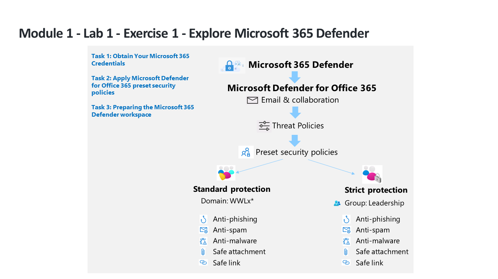

---
lab:
    title: 'Exercise 1 - Explore Microsoft 365 Defender'
    module: 'Learning Path 1 - Mitigate threats using Microsoft 365 Defender'
---

# Learning Path 1 - Lab 1 - Exercise 1 - Explore Microsoft 365 Defender

## Lab scenario

You are a Security Operations Analyst working at a company that is implementing Microsoft 365 Defender. You start by assigning preset security policies in EOP and Microsoft Defender for Office 365.

>**Note:** An **[interactive lab simulation](https://mslabs.cloudguides.com/guides/SC-200%20Lab%20Simulation%20-%20Explore%20Microsoft%20365%20Defender)** is available that allows you to click through this lab at your own pace. You may find slight differences between the interactive simulation and the hosted lab, but the core concepts and ideas being demonstrated are the same.

>**Note:** **WWL Tenants - Terms of Use**
If you are being provided with a tenant as a part of an instructor-led training delivery, please note that the tenant is made available for the purpose of supporting the hands-on labs in the instructor-led training. 
Tenants should not be shared or used for purposes outside of hands-on labs. The tenant used in this course is a trial tenant and cannot be used or accessed after the class is over and are not eligible for extension. 
Tenants must not be converted to a paid subscription. Tenants obtained as a part of this course remain the property of Microsoft Corporation and we reserve the right to obtain access and repossess at any time. 

### Task 1: Obtain Your Microsoft 365 Credentials

Once you launch the lab, a free trial tenant will be made available to you to access in the Microsoft virtual Lab environment. This tenant will be automatically assigned a unique username and password. You must retrieve this username and password so that you can sign into Azure and Microsoft 365 within the Microsoft Virtual Lab environment. 

Because this course can be offered by learning partners using any one of several Authorized Lab Hosting (ALH) providers, the actual steps involved to retrieve the tenant ID associated with your tenant may vary by lab hosting provider. Therefore, your instructor will provide you with the necessary instructions for how to retrieve this information for your course. The information that you should note for later use includes:

- **Tenant suffix ID.** This ID is for the onmicrosoft.com accounts that you will use to sign into Microsoft 365 throughout the labs. This is in the format of **{username}@ZZZZZZ.onmicrosoft.com**, where ZZZZZZ is your unique tenant suffix ID provided by your lab hosting provider. Record this ZZZZZZ value for later use. When any of the lab steps direct you to sign into Microsoft 365 portals, you must enter the ZZZZZZ value that you obtained here.
- **Tenant password.** This is the password for the admin account provided by your lab hosting provider.

### Task 2: Apply Microsoft Defender for Office 365 preset security policies

In this task, you will assign preset security policies for Exchange Online Protection (EOP) and Microsoft Defender for Office 365 in the Microsoft 365 security portal.

1. Login to WIN1 virtual machine as Admin with the password: **Pa55w.rd**.  

1. Start the Microsoft Edge browser.

1. In the Edge browser, go to the Microsoft 365 Defender portal at (https://security.microsoft.com).

1. In the **Sign in** dialog box, copy and paste in the tenant Email account for the admin username provided by your lab hosting provider and then select **Next**.

1. In the **Enter password** dialog box, copy and paste in the admin's tenant password provided by your lab hosting provider and then select **Sign in**.

    >**Note:** If you receive a message "The operation could not be completed. Please try again later. If the problem persists, contact Microsoft support." just click **OK** to continue.  

1. If shown, close the Microsoft 365 Defender quick tour pop-up window. **Hint:** Later in this lab, you will need to wait until the Defender workspace is provisioned, you can take this time to navigate through the guided tours to learn more about Microsoft 365 Defender.

1. From the navigation menu, under *Email & Collaboration* area, select **Policies & rules**.

1. On the *Policy & rules* dashboard, select **Threat policies**.

1. On the *Threat policies* dashboard, select **Preset Security Policies**.

    >**Note:** If you receive the message *"Client Error - Error when getting bip rule"* select **OK** to continue. The error is due to the hydration status of your tenant at Office 365 which is not enabled by default.

    >**Note:** If you receive the message *"Client Error - An error occurred when retrieving preset security policies. Please try again later."* select **OK** to continue. Refresh your browser using **Ctrl+F5**.

1. Under *Standard protection*, select **Manage protection settings**. **Hint:** If you see this option grayed out, refresh your browser using **Ctrl+F5**.

1. In the *Apply Exchange Online Protection* section, select **Specific recipients** and under **Domains** start writing your tenant's domain name, select it, and then select **Next**. **Hint:** You tenant's domain name is the same that you have for you admin account, it might be something like *WWLx######.onmicrosoft.com*. Notice that this configuration applies policies for anti-spam, outbound spam filter, anti-malware, anti-phishing. 

1. In the *Apply Defender for Office 365 protection* section, apply the same configuration as the previous step and select **Next**. Notice that this configuration applies policies for anti-phishing, Safe Attachments, Safe Links.

1. In the *Impersonation protection* section, select **Next** four times (4x) to continue.

1. In the *Policy mode* section, make sure the **Turn on the policy after I finish** radio button is selected, and then select **Next**.

1. Read the content under *Review and confirm your changes* and select **Confirm** to apply the changes and then select **Done** to finish.

    >**Note:** If you receive the message *"The URI 'https://outlook.office365.com/psws/service.svc/AntiPhishPolicy' is not valid for PUT operation. The URI must point to a single resource for PUT operations."* just select **OK** and then select **Cancel** to return to the main page. You will see that *Standard protection is on* option enabled.

1. Under *Strict protection*, select **Manage protection settings**. **Hint:** *Strict protection* is found under "Email & Collaboration - Policies & rules - Threat policies - Preset security policies".

1. In the *Apply Exchange Online Protection*, select **Specific recipients** and under **Groups** start writing **Leadership**, select it, and then select **Next**. Notice that this configuration applies policies for anti-spam, outbound spam filter, anti-malware, anti-phishing.

1. In the *Apply Defender for Office 365 protection* section, apply the same configuration as the previous step and select **Next**. Notice that this configuration applies policies for anti-phishing, Safe Attachments, Safe Links.

1. In the *Impersonation protection* section, select **Next** four times (4x) to continue.

1. In the *Policy mode* section, make sure the **Turn on the policy after I finish** radio button is selected, and then select **Next**.

1. Read the content under *Review and confirm your changes* and select **Confirm** to apply the changes and then select **Done** to finish.

    >**Note:** If you receive the message *"The URI 'https://outlook.office365.com/psws/service.svc/AntiPhishPolicy' is not valid for PUT operation. The URI must point to a single resource for PUT operations."* just select **OK** and then select **Cancel** to return to the main page. You will see the *Strict protection is on* option enabled.

### Task 3: Preparing the Microsoft 365 Defender workspace

1. On the **Microsoft 365 Defender** portal, from the navigation menu, select **Home** from the left.

    >**Note:** You may need to scroll all the way to the menu top.

1. On the **Home** portal page, **Welcome to Microsoft 365 Defender** is displayed.

1. Scroll down through the tiles until you find the tile labeled **Microsoft 365 Defender** with the message, **Turn on Microsoft 365 Defender.**

    >**Hint:** It should be at the bottom right of the tiles.

1. Select the button that says **Turn new features on.**

1. You will see messages saying *loading and Initializing* briefly displayed at the top of the page, and then you're going to see an image of a coffee mug and a message that reads: **Hang on! We're preparing new spaces for your data and connecting them.** It will take approximately 5 minutes to finish. *Leave the page open and make sure it finishes since it is required for the next Lab.*

    >**Note:** If you get the error message "We didn't plan it will fail, but something went wrong." retry the step later or do it before the next Lab.

1. When the new space completes successfully, you are going to see the Microsoft 365 Defender General settings for Account, Email notifications, Alert service settings, Permissions and roles and Streaming API. You will also see **Preview Features** turned on.

## You have completed the lab
