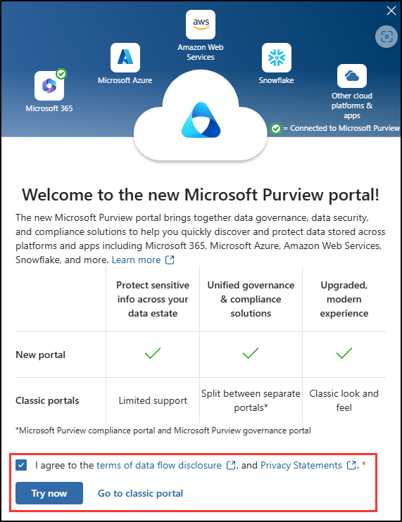
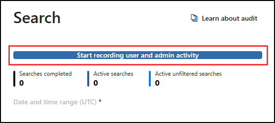

---
lab:
    title: 'Exercise 1 - Explore Microsoft Purview Audit logs'
    module: 'Learning Path 3 - Mitigate threats using Microsoft Purview'
---

# Learning Path 3 - Lab 1 - Exercise 1 - Explore Microsoft Purview Audit logs

## Lab scenario

You're a Security Operations Analyst working at a company that is implementing Microsoft Defender XDR and Microsoft Purview. You're assisting colleagues on the the IT compliance team with configuring both Purview Audit (Standard) and Audit (Premium). Their objective is to ensure that all access and modifications to patient data in our network of healthcare facilitie sare accurately logged to meet health data protection regulations.

>[!alert] If you receive an error message and are unable to start Audit recording in this exercise, please use these steps as a work around:
>
>1. Open an elevated PowerShell session by typing *PowerShell* in the Windows Search form, and then select **Run as Administrator**.
>1. Install the ExchangeOnlineManagement module by running `Install-Module -Name ExchangeOnlineManagement`
>1. Connect to ExchangeOnlineManagement by running `Connect-ExchangeOnline`
>1. When prompted, login by entering the administrator username and password from your lab hosting provider.
>1. To verify if Audit is enabled, run `Get-AdminAuditLogConfig | FL UnifiedAuditLogIngestionEnabled`
>1. If false, then the audit log is turned off.
>1. To enable Audit, run `Set-AdminAuditLogConfig -UnifiedAuditLogIngestionEnabled $true`
>1. If you receive an error that you are unable to run the script in your organization, run `Enable-OrganizationCustomization`
>1. Try again to run `Set-AdminAuditLogConfig -UnifiedAuditLogIngestionEnabled $true`
>1. To confirm Audit is enabled, run `Get-AdminAuditLogConfig | FL UnifiedAuditLogIngestionEnabled`
>1. Once complete, run `Disconnect-ExchangeOnline` to end your session

### Estimated time to complete this lab: 15 minutes

### Task 1: Enable Purview Audit logs

In this task, you'll assign preset security policies for Exchange Online Protection (EOP) and Microsoft Defender for Office 365 in the Microsoft 365 security portal.

1. Log in to WIN1 virtual machine as Admin with the password: **Pa55w.rd**.  

1. Start the Microsoft Edge browser.

1. In the Microsoft Edge browser, go to the Microsoft Defender XDR portal at <https://security.microsoft.com>.

1. In the **Sign in** dialog box, copy, and paste in the tenant Email account for the admin username provided by your lab hosting provider and then select **Next**.

1. In the **Enter password** dialog box, copy, and paste in the admin's tenant password provided by your lab hosting provider and then select **Sign in**.

1. From the navigation menu, expand *Operational technology* and select **More resources**.

1. In the **More resources** pane, select the **Open** button on the *Microsoft Purview portal* tile.

1. When the Microsoft Purview portal opens, a message appears stating that *The compliance Portal is retired*. This message will timeout and redirect you to new *Microsoft Purview portal*.

1. On the *Welcome to the new Microsoft Purview portal* message, select the option to agree with the terms of data flow disclosure and the privacy statement, then select **Try now**.

    

1. Select **Solutions** from the left sidebar, then select **Audit**.

1. On the **Search** page, select the blue **Start recording user and admin activity** bar to enable audit logging.

    

1. Once you select this option, the blue bar should disappear from this page.

    >**Note:**
    > It might take 60 minutes to start recording activities.

## You have completed the lab
