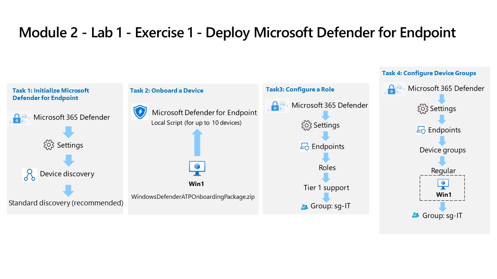

---
lab:
    title: 'Exercise 1 - Deploy Microsoft Defender for Endpoint'
    module: 'Learning Path 4 - Mitigate threats using Microsoft Defender for Endpoint'
---

# Learning Path 4 - Lab 1 - Exercise 1 - Deploy Microsoft Defender for Endpoint

## Lab scenario

You're a Security Operations Analyst working at a company that is implementing Microsoft Defender for Endpoint. Your manager plans to onboard a few devices to provide insight into required changes to the Security Operations (SecOps) team response procedures.

You start by initializing the Defender for Endpoint environment. Next, you onboard the initial devices for your deployment by running the onboarding script on the devices. You configure security for the environment. Lastly, you create Device groups and assign the appropriate devices.

>**Important:** The lab Virtual Machines are used through different modules. SAVE your virtual machines. If you exit the lab without saving, you will be required to re-run some configurations again.

>**Note:** Make sure you have completed successfully Task 3 of the first module.

### Estimated time to complete this lab: 30 minutes

### Task 1: Initialize Microsoft Defender for Endpoint

In this task, you'll perform the initialization of the Microsoft Defender for Endpoint.

1. Sign-in to **WIN1** virtual machine as Admin with the password: **Pa55w.rd**.  

1. If you aren't already at the Microsoft Defender XDR portal, start the Microsoft Edge browser.

1. In the Microsoft Edge browser, go to the Defender XDR portal at (<https://security.microsoft.com>).

1. In the **Sign in** dialog box, copy, and paste in the tenant Email account for the admin username provided by your lab hosting provider and then select **Next**.

1. In the **Enter password** dialog box, copy, and paste in the admin's tenant password provided by your lab hosting provider and then select **Sign in**.

    >**Tip:** The admin's tenant email account and password can be found on the Resources tab.

1. On the **Defender XDR** portal, from the navigation menu on the left, scroll down and expand the **System** section and select **Settings**.

    >**Note:** Some versions of the portal may not have the **Settings** option under the **System** section. **Settings** may be grouped with *Reports* and *Audit*.

1. On the Settings page, select **Device discovery**.

    >**Note:** If you do not see the **Device discovery** option under **Settings**, logout by selecting the top-right circle with your account initials and select **Sign out**. Other options that you might want to try is to refresh the page with Ctrl+F5 or open the page InPrivate. Login again with the **Tenant Email** credentials.

1. In Discovery setup, make sure **Standard discovery (recommended)** is selected. 

    >**Hint:** If you do not see the option, refresh the page.

### Task 2: Onboard a Device

In this task, you'll onboard a device to Microsoft Defender for Endpoint using an onboarding script.

1. In the **Defender XDR** portal, from the navigation menu on the left, scroll down and expand the **System** section and select **Settings**, then from the Settings page select **Endpoints**.

1. Select **Onboarding** in the Device management section.

    >**Note:** You can also perform device onboarding from the **Assets** section of the left menu bar. Expand Assets and select Devices. On the Device Inventory page, with Computers & Mobile selected, scroll down to **Onboard devices.** This takes you to the **Settings > Endpoints** page.

1. In the "1. Onboard a device" area make sure "Local Script (for up to 10 devices)" is displayed in the Deployment method drop-down and select the **Download onboarding package** button.

1. Under the *Downloads* pop-up, highlight the "WindowsDefenderATPOnboardingPackage.zip" file with your mouse and select the folder icon **Show in folder**. **Hint:** In case you don't see it, the file should be in the c:\users\admin\downloads directory.

    >**Tip:**
    > If your browser blocks the download, take action in the browser to allow it. In the Microsoft Edge Browser, you may see the message, "*WindowsDefenderATPOnboardingPackage.zip isn't commonly downloaded. Make sure you trust...*, select the ellipsis button (...) if needed and then select **Keep**. In Microsoft Edge a second pop-up appears with the message,"*Make sure you trust WindowsDefenderATPOnboardingPackage.zip before you open it*", select **Show more** to expand the selections and select **Keep anyway**.

1. Right-click the downloaded zip file and select **Extract All...**, make sure that *Show extracted files when complete* is checked and select **Extract**.

1. Right-click on the extracted file "WindowsDefenderATPLocalOnboardingScript.cmd" and select **Properties**. Select the **Unblock** checkbox in the bottom right of the Properties windows and select **OK**.

1. Right-click on the extracted file "WindowsDefenderATPLocalOnboardingScript.cmd" again and choose **Run as Administrator**.  **Hint:** If you encounter the Windows SmartScreen window, select on **More info**, and choose **Run anyway**.

1. When the "User Account Control" window is shown, select **Yes** to allow the script to run and answer **Y** to the question presented by the script and press **Enter**. When complete you should see a message in the command screen that says *Successfully onboarded machine to Microsoft Defender for Endpoint*.

1. Press any key to continue. This closes the Command Prompt window.

### Task 3: Configure Roles

In this task, you'll configure roles for use with device groups.

1. In the Microsoft Defender XDR portal left menu bar, expand the **System** section and select **Settings**, then select **Endpoints**.

1. Select **Roles** under the permissions area.

1. Select the **Turn on roles** button.

1. Select **+ Add role**.

1. In the Add role dialog, enter the following:

    |General setting|Value|
    |---|---|
    |Role name|**Tier 1 Support**|
    |Permissions|Live Response capabilities - Advanced|

1. Select **Next**.

1. On the **Assigned user groups** page, type **sg-IT** in the *Filter user groups* form, and then select **Add selected groups**. Make sure it appears under *Azure AD user groups with this role*.

1. Select **Submit** and then **Done** when finished.

    >**Note:** If you receive the error *"User can't perform this action since its UserAuthEnforcementMode is Rbac and this action requires one of: RbacV2"*, select **OK** and try again.

### Task 4: Configure Device Groups

In this task, you'll configure device groups that allow for access control and automation configuration.

1. In the Microsoft Defender XDR portal left menu bar, expand the **System** section and select **Settings**, then select **Endpoints**.

1. Select **Device groups** under the permissions area.

1. Select **+ Add device group** icon.

1. Enter the following information on the General tab:

    |General setting|Value|
    |---|---|
    |Device group name|**Regular**|
    |Remediation level|Full - remediate threats automatically|

1. Select **Next**.

1. On the Devices tab, for the OS condition select **Windows 11** and select **Next**.

    >**Note:** Some lab hosting providers may still have *Windows 10* images for WIN1. You can select either or both.

1. On the Preview devices tab, the *Show preview* button could show the WIN1 virtual machine, but most likely the data isn't populated yet. Select **Next** to continue.

1. For the User access tab, select **sg-IT** and then select **Add selected groups** button. Make sure it appears under *Azure AD user groups with access to this device group*.

1. Select **Submit** and then **Done** when finished.

1. Device group configuration has changed. Select **Apply changes** to check matches and recalculate groupings.

1. You're going to have two device groups now; the "Regular" you created and the "Ungrouped devices (default)" with the same remediation level.

## Proceed to Exercise 2
