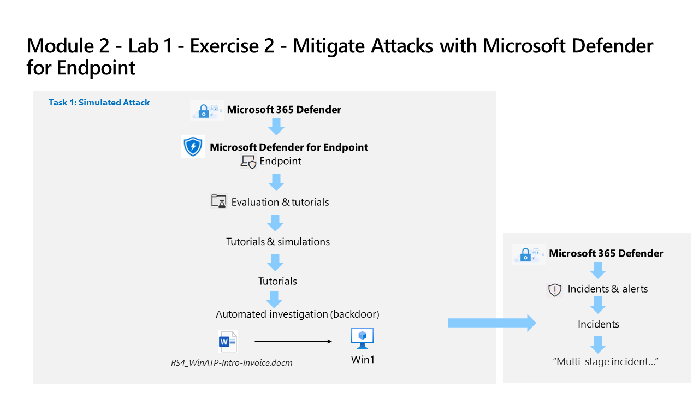

---
lab:
    title: 'Exercise 4 - Mitigate Attacks with Microsoft Defender for Endpoint'
    module: 'Learning Path 4 - Mitigate threats using Microsoft Defender for Endpoint'
---

# Learning Path 4 - Lab 1 - Exercise 2 - Mitigate Attacks with Microsoft Defender for Endpoint

## Lab scenario

You are a Security Operations Analyst working at a company that is implementing Microsoft Defender for Endpoint. Your manager plans to onboard a few devices to provide insight into required changes to the Security Operations (SecOps) team response procedures.

To explore the Defender for Endpoint attack mitigation capabilities, you will verify successful device onboarding and investigate alerts and incidents created during that process.

### Estimated time to complete this lab: 30 minutes

### Task 1: Verify Device onboarding

In this task, you will confirm that the device is onboarded successfully and create a test alert.

1. If you are not already at the Microsoft Defender XDR portal in your Microsoft Edge browser, go to (<https://security.microsoft.com>) and login as Admin for your tenant.

1. In the left-hand menu, under the **Assets** area, select **Devices**. Please wait until WIN1 appears in the Devices page before you continue. Otherwise, you might need to repeat this task to see the alerts that will be generated later.

    >**Note:** If you have completed the onboarding process and don't see devices in the Devices list after an hour, it might indicate an onboarding or connectivity problem.

1. In the Microsoft Defender XDR portal left menu bar, expand the **System** section and select **Settings**, then from the *Settings* page select **Endpoints**.

1. Select **Onboarding** in the Device management section and make sure *"Windows 10 and 11"* is selected as operating system. The *"First device onboarded"* message now shows *Completed*.

1. Scroll down and under the section *"2. Run a detection test"*, copy the detection test script by selecting the **Copy** button.  

1. In the windows search bar of the WIN1 virtual machine, type **CMD** and choose to **Run as Administrator** on the right pane for the Command Prompt app.

1. When the "User Account Control" window is shown, select **Yes** to allow the app to run. 

1. Paste the script by right-clicking in the **Administrator: Command Prompt** windows and press **Enter** to run it.

    >**Note:** The window closes automatically after successfully running the script, and after a few minutes alerts are generated in the Microsoft Defender XDR portal.

### Task 2: Investigate alerts and incidents

In this task, you will investigate the alerts and incidents generated by the onboarding detection test script in the previous task.

1. In the Microsoft Defender XDR portal expand **Investigation & responce** from the left menu bar, then expand **Incidents & alerts** and select **Alerts**.

    >**Note:** On updated versions of the Microsoft Defender XDR portal page *Incidents & alerts* are found under the *Investigations & response* menu heading.

1. In the **Alerts** pane, select the alert named *[TestAlert] Suspicious PowerShell commandline* to load its details.

1. Review the *Alert story* timeline, and then review the *Details* and *Recommendations* tabs.

    >**Note:** Under the alert *Details* tab you can scroll down to the *Incident details* section and select the *Execution incident on one endpoint* link to open the incident.

1. In the Microsoft Defender XDR portal select **Incidents & alerts** from the left menu bar, then select **Incidents**

1. Clear the *Alert severity* filter by selecting the **X** on the right of the filter.

1. A new incident called *Execution incident on one endpoint* appears in the right pane. Select the incident name to load its details.

1. Select the **Manage incident** link (with a pencil icon) and a new window blade appears.

1. Under **Incident tags** type "Simulation" and select **Simulation (Create new)** to create a new tag.

1. Select the toggle **Assign to**  and add your user account (Me) as owner of the incident.

1. Under **Classification**, expand the drop-down menu.

1. Under **Informational, expected activity**, select **Security testing**.

1. Select **Save** to update the incident and finish.

1. Review the contents of the *Attack story, Alerts, Assets, Investigations, Evidence and Response*, and *Summary* tabs. Devices and Users are under the *Assets* tab. In a real incident the *Attack story* tab displays the *Incident graph*. **Hint:** Some tabs might be hidden due the size of your display. Select the ellipsis tab (...) to make them appear.

### Task 3 Simulate an Attack

>**Warning:** This simulated attack is an excellent source of learning through practice. Only perform the attack in the instructions provided for this lab when using the course provided Azure tenant.  You may perform other simulated attacks *after* this training course is complete with this tenant.

In this task, you will simulate an attack on the WIN1 virtual machine (by running a PowerShell script) and verify that the attack is detected and mitigated by Microsoft Defender for Endpoint.

1. On the WIN1 virtual machine, type **PowerShell** into the Search bar, then *right-click* **Windows PowerShell** and and choose *Run as Administrator*.

1. When the "User Account Control" window is shown, select **Yes** to allow the app to run.

1. To run the script, in **Windows PowerShell (Admin)** navigate to the *\Users\Admin\Desktop\Allfiles* folder and type *.\AttackScript.ps1* and press **Enter** to run it. Next, type **R** and press **Enter** to *Run Once*.

1. The script will produce several lines of output and a message that it *Failed to resolve Domain Controllers in the domain*. A few seconds later, the *Notepad* app will open. A simulated attack code will be injected into Notepad. Keep the automatically generated Notepad instance open to experience the full scenario. The simulated attack code will attempt to communicate to an external IP address (simulating a C2 server).

### Task 4: Investigate the simulated attack as a single incident

1. In the Microsoft Defender XDR portal expand **Investigation & responce** from the left menu bar, then expand **Incidents & alerts** and select **Incidents**.

    >**Note:** On updated versions of the Microsoft Defender XDR portal page *Incidents & alerts* are found under the *Investigations & response* menu heading.

1. A new incident called *Multi-stage incident involving Defense evasion & Discovery on one endpoint* is in the right pane. Select the incident name to load its details.

    >**Note:** If you do not see the incident, make sure to clear the *Alert severity* filter by selecting the **X** on the right of the filter.

1. Under the *Attack story* tab, collapse the **Alerts** and **Incident details** panes to view the full **Incident graph**.

1. Mouse over and select the **Incident graph nodes** to review the *entities*.

1. Re-expand the **Alerts** pane (left-side) and select the **Play attack story** *Run* icon. This shows the attack timeline alert by alert and dynamically populates the *Incident graph*.

1. Review the contents of the *Attack story, Alerts, Assets, Investigations, Evidence and Response*, and *Summary* tabs. Devices and Users are under the *Assets* tab. **Hint:** Some tabs might be hidden due the size of your display. Select the ellipsis tab (...) to make them appear.

1. Under the **Evidence and Response** tab, select **IP addresses** then select the displayed *IP address*. In the pop-up window review the IP address details and scroll down and select the **Open IP address page** button.

1. Review the contents of the *Ip address* page *Overview, Incidents & alerts and Observed in organizations* tabs. Some tabs may not contain and information for the IP address.

## You have completed the lab
