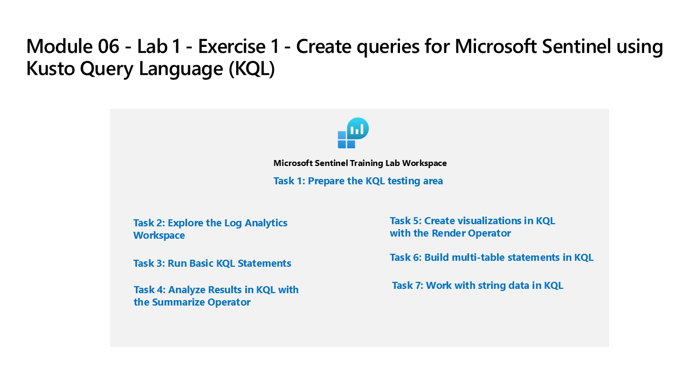

---
lab:
    title: 'Exercise 1 - Create queries for Microsoft Sentinel using Kusto Query Language (KQL)'
    module: 'Module 4 - Create queries for Microsoft Sentinel using Kusto Query Language (KQL)'
---

# Module 4 - Lab 1 - Exercise 1 - Create queries for Microsoft Sentinel using Kusto Query Language (KQL)

## Lab scenario



You are a Security Operations Analyst working at a company that is implementing Microsoft Sentinel. You are responsible for performing log data analysis to search for malicious activity, display visualizations, and perform threat hunting. To query log data, you use the Kusto Query Language (KQL).

>**Important:** This lab involves entering many KQL scripts into Microsoft Sentinel. The scripts were provided in a file at the beginning of this lab. An alternate location to download them is:  https://github.com/MicrosoftLearning/SC-200T00A-Microsoft-Security-Operations-Analyst/tree/master/Allfiles


### Task 1: Access the KQL testing area

In this task, you will access a Log Analytics environment where you can practice writing KQL statements.

1. Login to WIN1 virtual machine as Admin with the password: **Pa55w.rd**.  

1. Go to https://aka.ms/lademo in your browser. Login with the MOD Administrator credentials. 

1. Explore the available tables listed in the tab on the left side of the screen.

1. In the query editor, enter the following query and select the **Run** button. You should see the query results in the bottom window.

    ```KQL
    SecurityEvent
    ```

1. Next to the first record, select the **>** to expand the information for the row.


### Task 2: Run Basic KQL Statements

In this task, you will build basic KQL statements.

>**Important:**  For each query, clear the previous statement from the Query Window or open a new Query Windows by selecting **+** after the last opened tab (up to 25).

1. The following statement demonstrates the use of the **let** statement to declare *variables*. In the Query Window enter the following statement and select **Run**: 

    ```KQL
    let timeOffset = 1h;
    let discardEventId = 4688;
    SecurityEvent
    | where TimeGenerated > ago(timeOffset*2) and TimeGenerated < ago(timeOffset)
    | where EventID != discardEventId
    ```

1. The following statement demonstrates the use of the **let** statement to declare a *dynamic list*. In the Query Window enter the following statement and select **Run**: 

    ```KQL
    let suspiciousAccounts = datatable(account: string) [
      @"\administrator", 
      @"NT AUTHORITY\SYSTEM"
    ];
    SecurityEvent | where TimeGenerated > ago(1h) and Account in (suspiciousAccounts)
    ```

    >**Tip:** You can re-format the query easily by selecting the ellipsis (...) in the Query window and select **Format query**.
    
1. The following statement demonstrates the use of the **let** statement to declare a *dynamic table*. In the Query Window enter the following statement and select **Run**: 

    ```KQL
    let LowActivityAccounts =
        SecurityEvent 
        | summarize cnt = count() by Account 
        | where cnt < 10;
    LowActivityAccounts | where Account contains "sql"
    ```

1. Change the **Time range** to **Last hour** in the Query Window. This will limit our results for the following statements.

1. The following statement demonstrates the **search** operator, which searches all columns in the table for the value. In the Query Window enter the following statement and select **Run**: 

    ```KQL
    search "err"
    ```

1. The following statement demonstrates **search** across tables listed within the **in** clause. In the Query Window enter the following statement and select **Run**: 

    ```KQL
    search in (SecurityEvent,SecurityAlert,A*) "err"
    ```
1. Change back the **Time range** to **Last 24 hours** in the Query Window.

1. The following statements demonstrates the **where** operator, which filters on a specific predicate. In the Query Window enter the following statement and select **Run**: 

    >**Note:** You should select **Run** after entering each query from the code blocks below.

    ```KQL
    SecurityEvent  
    | where TimeGenerated > ago(1h)
    ```

    ```KQL
    SecurityEvent  
    | where TimeGenerated > ago(1h) and EventID == "4624"
    ```

    ```KQL
    SecurityEvent  
    | where TimeGenerated > ago(1h)
    | where EventID == 4624
    | where AccountType =~ "user"
    ```

    ```KQL
    SecurityEvent  
    | where TimeGenerated > ago(1h) and EventID in (4624, 4625)
    ```

1. The following statement demonstrates the **extend** operator, which creates a calculated column and adds it to the result set. In the Query Window enter the following statement and select **Run**: 

    ```KQL
    SecurityAlert  
    | where TimeGenerated > ago(90d)
    | extend severityOrder = case (  
    AlertSeverity == "High",3,
    AlertSeverity == "Medium",2,
    AlertSeverity == "Low",1,
    AlertSeverity == "Informational",0,
    -1)
    ```

1. The following statement demonstrates the **order by** operator, which sorts the rows of the input table by one or more columns in ascending or descending order. The **order by** operator is an alias to the **sort by** operator. In the Query Window enter the following statement and select **Run**: 

    ```KQL
    SecurityAlert  
    | where TimeGenerated > ago(90d)
    | extend severityOrder = case (  
    AlertSeverity == "High",3,
    AlertSeverity == "Medium",2,
    AlertSeverity == "Low",1,
    AlertSeverity == "Informational",0,
    -1)
    | order by severityOrder desc
    ```

1. The following statements demonstrate the **project** operator, which selects the columns to include in the order specified. In the Query Window enter the following statement and select **Run**: 

    ```KQL
    SecurityEvent  
    | where TimeGenerated > ago(1h)
    | project Computer, Account
    ```

1. The following statements demonstrate the **project-away** operator, which selects the columns to exclude from the output. In the Query Window enter the following statement and select **Run**: 

    ```KQL
    SecurityAlert  
    | where TimeGenerated > ago(90d)
    | extend severityOrder = case (  
    AlertSeverity == "High",3,
    AlertSeverity == "Medium",2, 
    AlertSeverity == "Low",1,
    AlertSeverity == "Informational",0,
    -1)
    | order by severityOrder
    | project-away severityOrder
    ```


### Task 3: Analyze Results in KQL with the Summarize Operator

In this task, you will build KQL statements to aggregate data. **Summarize** groups the rows according to the **by** group columns, and calculates aggregations over each group.

1. The following statement demonstrates the **count()** function, which returns a count of the group. In the Query Window enter the following statement and select **Run**: 

    ```KQL
    SecurityEvent  
    | where TimeGenerated > ago(1h) and EventID == 4688
    | summarize count() by Process, Computer
    ```

1. The following statement demonstrates the **count()** function, but in this example, we name the column as *cnt*. In the Query Window enter the following statement and select **Run**: 

    ```KQL
    SecurityEvent  
    | where TimeGenerated > ago(1h) and EventID == 4624
    | summarize cnt=count() by AccountType, Computer
    ```

1. The following statement demonstrates the **dcount()** function, which returns an approximate distinct count of the group elements. In the Query Window enter the following statement and select **Run**: 

    ```KQL
    SecurityEvent  
    | where TimeGenerated > ago(1h)
    | summarize dcount(IpAddress)
    ```

1. The following statement demonstrates the **arg_max()** function, which returns one or more expressions when the argument is maximized. The following statement will return the most current row from the SecurityEvent table for the computer SQL12.NA.contosohotels.com. The * in the arg_max function requests all columns for the row. In the Query Window enter the following statement and select **Run**: 

    ```KQL
    SecurityEvent  
    | where Computer == "SQL12.na.contosohotels.com"
    | summarize arg_max(TimeGenerated,*) by Computer
    ```

1. The following statement demonstrates the **arg_min()** function, which returns one or more expressions when the argument is minimized. In this statement, the oldest SecurityEvent for the computer SQL12.NA.contosohotels.com will be returned as the result set. In the Query Window enter the following statement and select **Run**: 

    ```KQL
    SecurityEvent  
    | where Computer == "SQL12.na.contosohotels.com"
    | summarize arg_min(TimeGenerated,*) by Computer
    ```

1. The following statements demonstrate the importance of understanding results based on the order of the *pipe*. In the Query Window enter the following queries and run each query separately: 

    1. **Query 1** will have Accounts for which the last activity was a login. The SecurityEvent table will first be summarized and return the most current row for each Account. Then only rows with EventID equals 4624 (login) will be returned.

        ```KQL
        SecurityEvent  
        | summarize arg_max(TimeGenerated, *) by Account
        | where EventID == 4624
        ```

    1. **Query 2** will have the most recent login for Accounts that have logged in. The SecurityEvent table will be filtered to only include EventID = 4624. Then these results will be summarized for the most current login row by Account.

        ```KQL
        SecurityEvent  
        | where EventID == 4624 
        | summarize arg_max(TimeGenerated, *) by Account
        ```

    >**Note:**  You can also review the "Total CPU" and "Data used for processed query" by selecting the bar "Completed" and compare the data between both statements.

1. The following statement demonstrates the **make_list()** function, which returns a *list* of all the values within the group. This KQL query will first filter the EventID with the where operator. Next, for each Computer, the results are a JSON array of Accounts. The resulting JSON array will include duplicate accounts. In the Query Window enter the following statement and select **Run**: 

    ```KQL
    SecurityEvent  
    | where TimeGenerated > ago(1h)
    | where EventID == 4624 
    | summarize make_list(Account) by Computer
    ```

1. The following statement demonstrates the **make_set()** function, which returns a set of *distinct* values within the group. This KQL query will first filter the EventID with the where operator. Next, for each Computer, the results are a JSON array of unique Accounts. In the Query Window enter the following statement and select **Run**: 

    ```KQL
    SecurityEvent  
    | where TimeGenerated > ago(1h)
    | where EventID == 4624 
    | summarize make_set(Account) by Computer
    ```


### Task 4: Create visualizations in KQL with the Render Operator

In this task, you will use generate visualizations with KQL statements.

1. The following statement demonstrates the **render** operator (which renders results as a graphical output), using a **barchart** visualization. In the Query Window enter the following statement and select **Run**: 

    ```KQL
    SecurityEvent  
    | where TimeGenerated > ago(1h)
    | summarize count() by Account
    | render barchart
    ```

1. The following statement demonstrates the **render** operator visualizing results with a time series. The **bin()** function rounds all values in a timeframe and groups them, used frequently in combination with **summarize**. If you have a scattered set of values, the values are grouped into a smaller set of specific values. Combining the generated results and pipe them to a **render** operator with a **timechart** provides a time series visualization. In the Query Window enter the following statement and select **Run**: 

    ```KQL
    SecurityEvent  
    | where TimeGenerated > ago(1h)
    | summarize count() by bin(TimeGenerated, 1m)
    | render timechart
    ```


### Task 5: Build multi-table statements in KQL

In this task, you will build multi-table KQL statements.

1. Change the **Time range** to **Last hour** in the Query Window. This will limit our results for the following statements.

1. The following statement demonstrates the **union** operator, which takes two or more tables and returns all their rows. Understanding how results are passed and impacted with the pipe character is essential. In the Query Window enter the following statements and select **Run** for each query separately to see the results: 

    1. **Query 1** will return all rows of SecurityBaseline and all rows of SecurityEvent.

        ```KQL
        SecurityBaseline  
        | union SecurityEvent
        ```

    1. **Query 2** will return one row and column, which is the count of all rows of SecurityBaseline and all rows of SecurityEvent.

        ```KQL
        SecurityBaseline  
        | union SecurityEvent
        | summarize count() 
        ```

    1. **Query 3** will return all rows of SecurityBaseline and one (last) row for SecurityEvent. The last row for SecurityEvent will have the summarized count of the total number of rows.

        ```KQL
        SecurityBaseline  
        | union (SecurityEvent | summarize count() | project count_)
        ```

1. The following statement demonstrates the **union** operator support to union multiple tables with wildcards. In the Query Window enter the following statement and select **Run**: 

    ```KQL
    union Security*
    | summarize count() by Type
    ```

1. The following statement demonstrates the **join** operator, which merges the rows of two tables to form a new table by matching values of the specified column(s) from each table. In the Query Window enter the following statement and select **Run**: 

    ```KQL
    SecurityEvent  
    | where EventID == "4624" 
    | summarize LogOnCount=count() by EventID, Account
    | project LogOnCount, Account
    | join kind = inner( 
     SecurityEvent  
    | where EventID == "4634" 
    | summarize LogOffCount=count() by EventID, Account
    | project LogOffCount, Account
    ) on Account
    ```

    >**Important:** The first table specified in the join is considered the Left table. The table after the **join** operator is the right table. When working with columns from the tables, the $left.Column name and $right.Column name is to distinguish which tables column are referenced. The **join** operator supports a full range of types: flouter, inner, innerunique, leftanti, leftantisemi, leftouter, leftsemi, rightanti, rightantisemi, rightouter, rightsemi.

1. Change back the **Time range** to **Last 24 hours** in the Query Window.


### Task 6: Work with string data in KQL

In this task, you will work with structured and unstructured string fields with KQL statements.

1. The following statement demonstrates the **extract** function, which gets a match for a regular expression from a source string. You have the option to convert the extracted substring to the indicated type. In the Query Window, enter the following statement and select **Run**: 

    ```KQL
    print extract("x=([0-9.]+)", 1, "hello x=45.6|wo") == "45.6"
    ```

1. The following statements use the **extract** function to pull out the Account Name from the Account field of the SecurityEvent table. In the Query Window enter the following statement and select **Run**: 

    ```KQL
    let top3 = SecurityEvent
    | where TimeGenerated > ago(1h) 
    | where AccountType == 'User'
    | extend Account_Name = extract(@"^(.*\\)?([^@]*)(@.*)?$", 2, tolower(Account))
    | summarize Attempts = count() by Account_Name
    | where Account_Name != ""
    | top 3 by Attempts 
    | summarize make_list(Account_Name);
    SecurityEvent  
    | where TimeGenerated > ago(1h)
    | where AccountType == 'User'
    | extend Name = extract(@"^(.*\\)?([^@]*)(@.*)?$", 2, tolower(Account))
    | extend Account_Name = iff(Name in (top3), Name, "Other")
    | where Account_Name != ""
    | summarize Attempts = count() by Account_Name
    | sort by Attempts
    ```

1. The following statement demonstrates the **parse** operator, which evaluates a string expression and parses its value into one or more calculated columns. Use for structuring unstructured data. In the Query Window enter the following statement and select **Run**: 

    ```KQL
    let Traces = datatable(EventText:string)
    [
    "Event: NotifySliceRelease (resourceName=PipelineScheduler, totalSlices=27, sliceNumber=23, lockTime=02/17/2016 08:40:01, releaseTime=02/17/2016 08:40:01, previousLockTime=02/17/2016 08:39:01)",
    "Event: NotifySliceRelease (resourceName=PipelineScheduler, totalSlices=27, sliceNumber=15, lockTime=02/17/2016 08:40:00, releaseTime=02/17/2016 08:40:00, previousLockTime=02/17/2016 08:39:00)",
    "Event: NotifySliceRelease (resourceName=PipelineScheduler, totalSlices=27, sliceNumber=20, lockTime=02/17/2016 08:40:01, releaseTime=02/17/2016 08:40:01, previousLockTime=02/17/2016 08:39:01)",
    "Event: NotifySliceRelease (resourceName=PipelineScheduler, totalSlices=27, sliceNumber=22, lockTime=02/17/2016 08:41:01, releaseTime=02/17/2016 08:41:00, previousLockTime=02/17/2016 08:40:01)",
    "Event: NotifySliceRelease (resourceName=PipelineScheduler, totalSlices=27, sliceNumber=16, lockTime=02/17/2016 08:41:00, releaseTime=02/17/2016 08:41:00, previousLockTime=02/17/2016 08:40:00)"
    ];
    Traces  
    | parse EventText with * "resourceName=" resourceName ", totalSlices=" totalSlices:long * "sliceNumber=" sliceNumber:long * "lockTime=" lockTime ", releaseTime=" releaseTime:date "," * "previousLockTime=" previousLockTime:date ")" *  
    | project resourceName, totalSlices, sliceNumber, lockTime, releaseTime, previousLockTime
    ```

1. The following statement demonstrates working with **dynamic** fields, which are special since they can take on any value of other data types. In this example, the *Properties* field from the *AppAvailabilityResults* table is of type **dynamic**. In the Query Window enter the following statement and select **Run**: 

    ```KQL
    AppAvailabilityResults | project Properties
    ```

1. The results shows unparsed results. To access the strings within a **dynamic** field, use the dot notation. In the Query Window enter the following statement and select **Run**: 

    ```KQL
    AppAvailabilityResults | project Name=Properties.WebtestArmResourceName, Location=Properties.WebtestLocationId, Id=Properties.SyntheticMonitorId
    ```

    >**Important:** Although the dynamic type appears JSON-like, it can hold values that the JSON model does not represent because they do not exist in JSON. Therefore, in serializing dynamic values into a JSON representation, values that JSON cannot represent are serialized into string values. 

1. The following statements demonstrates operators to manipulate JSON stored in string fields. Many logs submit data in JSON format, which requires you to know how to transform JSON data to fields that can be queried. In the Query Window enter the following statement and select **Run**: 

    ```KQL
    ContainerInventory  
    | where TimeGenerated > ago(1h) 
    | extend Command = todynamic(Command) 
    | extend Cmd = Command.[0]
    | extend Param1 = Command.[1]
    | extend Param2 = Command.[2]
    | project-away Command 
    | order by tostring(Cmd)
    ```

1. The following statement demonstrates the **mv-expand** operator, which turns dynamic arrays into rows (multi-value expansion).

    ```KQL
    ContainerInventory  
    | where TimeGenerated > ago(1h)
    | mv-expand Command = todynamic(Command) 
    | project ContainerHostname,Command
    ```

1. The following statement demonstrates the **mv-apply** operator, which applies a subquery to each record and returns the union of the results of all subqueries.

    ```KQL
    SecurityAlert  
    | where TimeGenerated > ago(90d)
    | mv-apply entity = todynamic(Entities) on 
    ( where entity.Type == "host" | extend AffectedHost = strcat (entity.DnsDomain, "\\", entity.HostName))
    ```

1. A **function** is a log query that can be used in other log queries with the saved name as a command. To create a **function**, after running your query, select the **Save** button and then select **Save As function** from the drop-down. Enter the name your want (for example: *MailboxForward*) in the **Function name** box and enter a **Legacy category** (for example: *General*) and select **Save**. The function will be available in KQL by using the function's alias:

    >**Note:** You will not be able to do this in the lademo environment used for this lab since your account has only Reader permissions, but it is an important concept to make your queries more efficient and effective. 

    ```KQL
    MailboxForward
    ```

## You have completed the lab.
