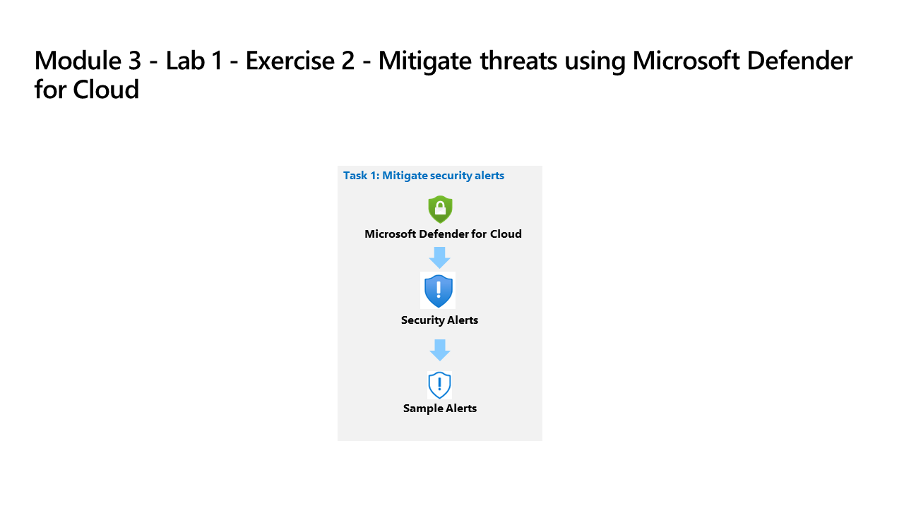

---
lab:
    title: 'Exercise 2 - Mitigate threats using Microsoft Defender for Cloud'
    module: 'Learning Path 5 - Mitigate threats using Microsoft Defender for Cloud'
---

# Learning Path 5 - Lab 1 - Exercise 2 - Mitigate threats using Microsoft Defender for Cloud

## Lab scenario

You're a Security Operations Analyst working at a company that implemented Microsoft Defender for Cloud. You need to respond to recommendations and security alerts generated by Microsoft Defender for Cloud.

### Estimated time to complete this lab: 15 minutes

### Task 1: Explore Regulatory Compliance

In this task, you'll review Regulatory compliance configuration in Microsoft Defender for Cloud. 

>**Important:** The next steps are done in a different machine than the one you were previously working. Look for the Virtual Machine name references.

1. Log in to **WIN1** virtual machine as Admin with the password: **Pa55w.rd**.  

1. In the Microsoft Edge browser, open the Azure portal at <https://portal.azure.com>.

1. In the **Sign in** dialog box, copy, and paste in the **Tenant Email** account provided by your lab hosting provider and then select **Next**.

1. In the **Enter password** dialog box, copy, and paste in the **Tenant Password** provided by your lab hosting provider and then select **Sign in**.

1. In the Search bar of the Azure portal, type *Defender*, then select **Microsoft Defender for Cloud**.

1. Under *Cloud Security*, select **Regulatory compliance** from the left menu items.

1. Select **Manage compliance standards** on the toolbar.

1. Select your subscription.

    >**Hint:** Select **Expand all** to find your subscription if you have a hierarchy of Management Groups.

1. Under *Settings*, select **Security policies** in the portal menu.

1. Scroll down and review the "Security standards" available to you by default.

1. Use the search box to find *ISO 27001:2013*.

1. Select and move the **Status** slider to right of *ISO 27001:2013* to **On**.

    >**Note:** Some standards require you to assign an Azure Policy initiative.

1. Select **Refresh** on the page menu to confirm that *ISO 27001:2013* is set to *On* for your subscription.

1. Close the *Security policies* page by selecting the 'X' on the upper right of the page to go back to the **Environment settings**.

    >**Note:** You might want to return later to *Regulatory compliance* to review the new standard controls and recommendations.

### Task 2: Explore Security posture and recommendations

In this task, you'll review cloud security posture management.  The Secure Score information can take 24 hours to recalculate. It's recommended to do this task again in 24 hours.

1. Under *Cloud Security*, select **Security posture** from the left menu items.

1. The *Secure score* defaults to the *Azure environment*.

1. Under the *Environment* tab, select **View recommendations >** link.

1. Select **Add filter** and then select **Resource type**.

1. Select the **Machines - Azure Arc** checkbox and then select the **Apply** button.

    >**Note:** If you don't see **Machines - Azure Arc** listed, make sure you have completed Learning Path 3 - Lab 1 - Exercise 1 Task 4..

1. Select any recommendation where the status isn't *"Completed"*.

1. Review the recommendation and in the **Take action** tab scroll down to **Delegate** and select **Assign owner & set due date**.

1. In the **Create assignment** window, leave *Type* set to *Defender for Cloud* and expand the **Assignment details**.

1. In the `Set owner` *Email address* box, type in your admin email. **Hint:** You can copy it from the instructions in the *Resources* tab.

1. Explore the *Set remediation timeframe* and *Set email notifications* options and select **Create**.

    >**Note:** If you see the error *Failed to create requested assignments*, try again later.

1. Close the recommendation page by selecting the 'X' on the upper right of the window.

### Task 3: Mitigate security alerts

In this task, you'll load sample security alerts and review the alert details.

1. Under *General*, select **Security alerts** in the portal menu.

1. Select **Sample alerts** from the command bar. **Hint:** you may need to select the ellipsis (...) button from the command bar.

1. In the Create sample alerts (Preview) pane make sure your subscription is selected and that all sample alerts are selected in the *Defender for Cloud plans* area.

1. Select **Create sample alerts**.  

    >**Note:** This sample alert creation process may take a few minutes to complete, wait for the *"Successfully created sample alerts"* notification.

1. Once completed, select **Refresh** (if needed) to see the alerts appear under the *Security alerts* area.

1. Choose an interesting alert with a *Severity* of *High* and perform the following actions:

    - Select the alert checkbox and the alert detail pane should appear. Select **View full details**.

    - Review and read the *Alert details* tab.

    - Select the **Take action** tab or scroll down and select the **Next: Take Action** button at the end of the page.

    - Review the *Take action* information. Notice the sections available to take action depending on the type of alert: Inspect resource context, Mitigate the threat, Prevent future attacks, Trigger automated response and Suppress similar alerts.

## You have completed the lab.
