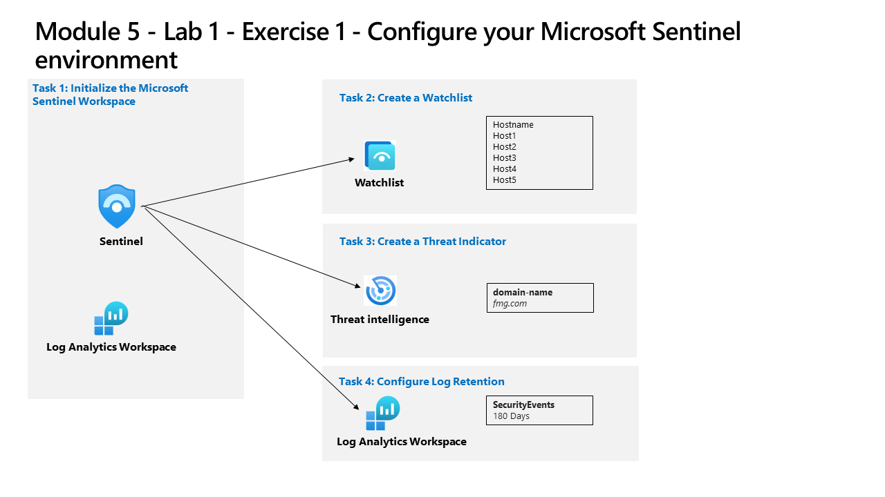

---
lab:
    title: 'Exercise 1 - Configure your Microsoft Sentinel environment'
    module: 'Learning Path 5 - Configure your Microsoft Sentinel environment'
---

# Learning Path 5 - Lab 1 - Exercise 1 - Configure your Microsoft Sentinel environment

## Lab scenario



You are a Security Operations Analyst working at a company that is implementing Microsoft Sentinel. You are responsible for setting up the Microsoft Sentinel environment to meet the company requirement to minimize cost, meet compliance regulations, and provide the most manageable environment for your security team to perform their daily job responsibilities.

**Note:** An **[interactive lab simulation](https://mslabs.cloudguides.com/guides/SC-200%20Lab%20Simulation%20-%20Configure%20your%20Microsoft%20Sentinel%20environment)** is available that allows you to click through this lab at your own pace. You may find slight differences between the interactive simulation and the hosted lab, but the core concepts and ideas being demonstrated are the same. 


### Task 1: Initialize the Microsoft Sentinel Workspace

In this task, you will create a Microsoft Sentinel workspace.

1. Log in to **WIN1** virtual machine as Admin with the password: **Pa55w.rd**.  

1. Open the Edge browser.

1. In the Edge browser, navigate to the Azure portal at https://portal.azure.com.

1. In the **Sign in** dialog box, copy and paste in the **Tenant Email** account provided by your lab hosting provider and then select **Next**.

1. In the **Enter password** dialog box, copy and paste in the **Tenant Password** provided by your lab hosting provider and then select **Sign in**.

1. In the Search bar of the Azure portal, type *Sentinel*, then select **Microsoft Sentinel**.

1. Select **+ Create**.

1. Next, select the Log Analytics workspace you created earlier, for example *uniquenameDefender* and select **Add**. The activation could take a few minutes.

    >**Note:** If you do not see a Log Analytics workspace here, please refer to Module 3, Exercise 1, Task 2 to create one.

1. Navigate around the newly created Microsoft Sentinel workspace to become familiar with the user interface options.


### Task 2: Create a Watchlist

In this task, you will create a watchlist in Microsoft Sentinel.

1. In the search box at the bottom of the Windows 10 screen, enter *Notepad*. Select **Notepad** from the results.

1. Type *Hostname* then enter for a new line.

1. From row 2 of the notepad, copy the following hostnames, each one in a different line:

    ```Notepad
    Host1
    Host2
    Host3
    Host4
    Host5
    ```

1. From the menu select, **File - Save As**, Name the file *HighValue.csv*, change the file type to **All files(*.*)** and select **Save**. **Hint:** The file can be saved in the *Documents* folder.

1. Close Notepad.

1. In Microsoft Sentinel, select the **Watchlist** option under the Configuration area.

1. Select **+ Add new** from the command bar.

1. In the Watchlist wizard, enter the following:

    |General setting|Value|
    |---|---|
    |Name|**HighValueHosts**|
    |Description|**High Value Hosts**|
    |Watchlist alias|**HighValueHosts**|

1. Select, **Next: Source >**.

1. Select **Browse for files** under *Upload file* and browse for the *HighValue.csv* file you just created.

1. In the *SearchKey field* select **Hostname**.

1. Select **Next: Review and Create >**.

1. Review the settings you entered and select **Create**.

1. The screen returns to the Watchlist page.

1. Select the *HighValueHosts* watchlist and on the right pane, select **View in logs**.

    >**Important:** It could take up to ten minutes for the watchlist to appear. **Please continue to with the following task and run this command on the next lab**.
    
    >**Note:** You can now use the _GetWatchlist('HighValueHosts') in your own KQL statements to access the list. The column to reference would be *Hostname*.

1. Close the *Logs* window by selecting the 'x' in the top-right and select **OK** to discard the unsaved edits.


### Task 3: Create a Threat Indicator

In this task, you will create an indicator in Microsoft Sentinel.

1. In Microsoft Sentinel, select the **Threat intelligence** option in the Threat management area.

1. Select **+ Add New** from the command bar.

1. Review the different indicator types available in the *Types* dropdown. Select the **domain-name**. Enter your initials in the Domain box. An example would be *fmg.com*.

1. For the *Threat types*, write down **malicious-activity** and select **OK**.

1. For the *Name*, enter the same value used for the Domain. An example would be *fmg.com*.

1. Set the *Valid from* field to today's date.

1. Select **Apply**.

1. Select the **Logs** option under the General area. You might want to disable the "Always show queries" option and close the *Queries* window to run the KQL statements.

1. Run the following KQL statement.

    ```KQL
    ThreatIntelligenceIndicator
    ```

    >**Note:** It could take up to five minutes for the indicator to appear.

1. Scroll the results to the right to see the DomainName column. You can also run the following KQL statement to just see the DomainName column. 

    ```KQL
    ThreatIntelligenceIndicator | project DomainName
    ```


### Task 4: Configure log retention

In this task, you will change the retention period for the SecurityEvent table.

1. In Microsoft Sentinel, select the **Settings** option in the *Configuration* area.

1. Select **Workspace settings**.

1. In Log Analytics workspace, select the **Tables (preview)** option in the *Settings* area.

1. Search and select the table **SecurityEvent**, and then select the ellipsis button (...).

1. Select **Manage Table**.

1. Select **180 days** for *Total retention period*. Then **Save**.


## You have completed the lab.
