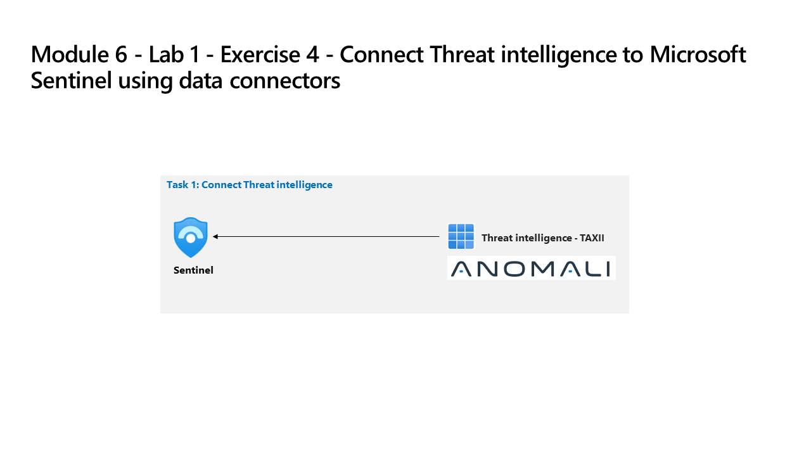

---
lab:
    title: 'Exercise 4 - Connect Defender XDR to Microsoft Sentinel using data connectors'
    module: 'Learning Path 6 - Connect logs to Microsoft Sentinel'
---

# Learning Path 6 - Lab 1 - Exercise 4 - Connect Defender XDR to Microsoft Sentinel using data connectors

## Lab scenario

You're a Security Operations Analyst working at a company that deployed both Microsoft Defender XDR and Microsoft Sentinel. You need to prepare for the Unified Security Operations Platform connecting Microsoft Sentinel to Defender XDR. Your next step will be to install the Defender XDR Content Hub solution and deploy the Defender XDR data connector to Microsoft Sentinel.

### Task 1: Connect Defender XDR

In this task, you'll deploy the Microsoft Defender XDR connector.

1. Login to WIN1 virtual machine as Admin with the password: **Pa55w.rd**.  

1. In the Microsoft Edge browser, navigate to the Azure portal at (<https://portal.azure.com>).

1. In the **Sign in** dialog box, copy, and paste in the **Tenant Email** account provided by your lab hosting provider and then select **Next**.

1. In the **Enter password** dialog box, copy, and paste in the **Tenant Password** provided by your lab hosting provider and then select **Sign in**.

1. In the Search bar of the Azure portal, type *Sentinel*, then select **Microsoft Sentinel**.

1. Select your Microsoft Sentinel Workspace you created earlier.

1. In the Microsoft Sentinel left menus, scroll down to the **Content management** section and select **Content Hub**.

1. In the *Content hub*, search for the **Microsoft Defender XDR** solution and select it from the list.

1. On the *Microsoft Defender XDR* solution details page select **Install**.

1. When the installation completes,  search for the **Microsoft Defender XDR** solution and select it.

1. On the *Microsoft Defender XDR* solution details page select **Manage**

>**Note:** The *Microsoft Defender XDR* solution installs the *Microsoft Defender XDR* Data connector, Hunting queries, Workbooks and Analytics rules.

1. Select the *Microsoft Defender XDR* Data connector check-box, and select **Open connector page**.

1. In the *Configuration* section, under the *Instructions* tab, **deselect** the checkbox for the *Turn off all Microsoft incident creation rules for these products. Recommended*, and select the **Connect incidents & alerts** button.

1. You should see a message that the connection was successful.

## You have completed the lab
