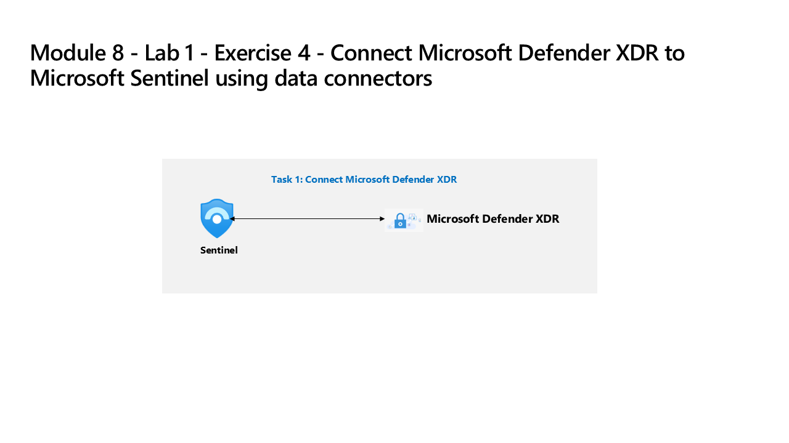

---
lab:
  title: Exercise 4 - Connect Defender XDR to Microsoft Sentinel using data connectors
  module: Learning Path 7 - Connect logs to Microsoft Sentinel
  description: In this task, you deploy the Microsoft Defender XDR connector.
  duration: 40 minutes
  level: 200
  islab: true
  primarytopics:
    - Microsoft Defender
    - Microsoft Defender XDR
    - Microsoft Sentinel
---

# Learning Path 7 - Lab 1 - Exercise 4 - Connect Defender XDR to Microsoft Sentinel using data connectors

## Lab scenario

You're a Security Operations Analyst working at a company that deployed both Microsoft Defender XDR and Microsoft Sentinel. You need to prepare for the Unified Security Operations Platform connecting Microsoft Sentinel to Defender XDR. Your next step will be to install the Defender XDR Content Hub solution and deploy the Defender XDR data connector to Microsoft Sentinel.

>**Note:**
> The environment for this exercise is a simulation generated from the product. As a limited simulation, links on a page may not be enabled and text-based inputs that fall outside of the specified script may not be supported. A pop-up message will display stating, "This feature is not available within the simulation." When this occurs, select OK and continue the exercise steps.

In this exercise, you use *Interactive Guides* to simulate performing the following tasks:

- Connect a new Microsoft Sentinel workspace to Microsoft Defender XDR.
- Connect an existing Microsoft Sentinel workspace to Microsoft Defender XDR.
- Explore the Microsoft Sentinel capabilities in the Microsoft Defender XDR portal.

### Task 1: Connect a new Microsoft Sentinel workspace to Defender XDR

In this interactive guide, which takes approximately 10 minutes to complete, you onboard a new Microsoft Sentinel workspace to Defender XDR.

Select the image below to get started.

### Task 2: Connect an existing Microsoft Sentinel workspace to Defender XDR

In this Interactive Guide, which takes approximately 10 minutes to complete, you connect an existing Microsoft Sentinel workspace to Defender XDR.

Select the image below to get started.

You have completed the simulation exercises to connect Microsoft Sentinel to Microsoft Defender XDR. You can now explore the Microsoft Sentinel capabilities in the Microsoft Defender portal.

>**Note:** Feel free to explore and compare the other Microsoft Sentinel capabilities, but as this is a simulation, your ability to explore Microsoft Sentinel in the Microsoft Defender portal is limited. In a real environment, you would be able to explore the full Microsoft Sentinel capabilities in the Microsoft Defender portal..

## You completed the lab - Please proceed to Learning Path 9 - Lab 1 - Exercise 1 - Modify a Microsoft Security rule
