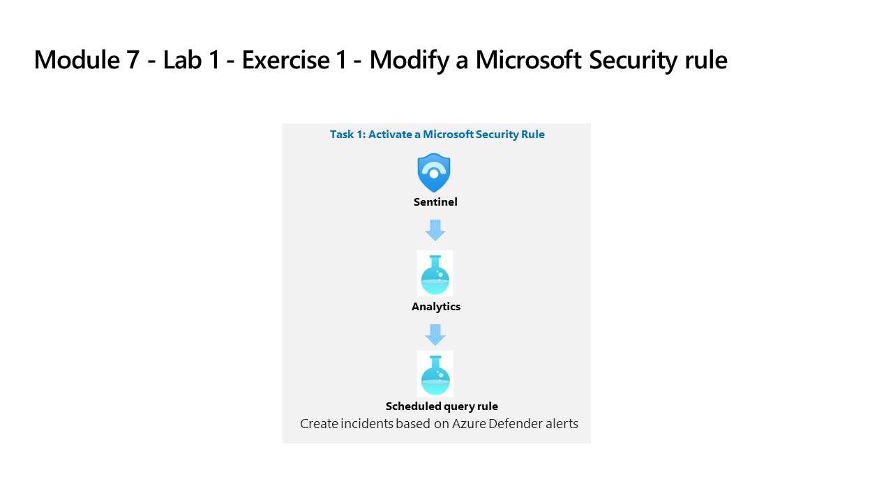

---
lab:
    title: 'Exercise 1 - Modify a Microsoft Security rule'
    module: 'Learning Path 7 - Create detections and perform investigations using Microsoft Sentinel'
---

# Learning Path 7 - Lab 1 - Exercise 1 - Modify a Microsoft Security rule

## Lab scenario

You are a Security Operations Analyst working at a company that implemented Microsoft Sentinel. You must learn how to detect and mitigate threats using Microsoft Sentinel. First, you need to filter the alerts coming from Defender for Cloud into Microsoft Sentinel, by Severity. 

>**Note:** An **[interactive lab simulation](https://mslabs.cloudguides.com/guides/SC-200%20Lab%20Simulation%20-%20Modify%20a%20Microsoft%20Security%20rule)** is available that allows you to click through this lab at your own pace. You may find slight differences between the interactive simulation and the hosted lab, but the core concepts and ideas being demonstrated are the same. 

### Task 1: Activate a Microsoft Security Rule

In this task, you will activate a Microsoft Security rule.

1. Log in to WIN1 virtual machine as Admin with the password: **Pa55w.rd**.  

1. In the Edge browser, navigate to the Azure portal at (https://portal.azure.com).

1. In the **Sign in** dialog box, copy, and paste in the **Tenant Email** account provided by your lab hosting provider and then select **Next**.

1. In the **Enter password** dialog box, copy, and paste in the **Tenant Password** provided by your lab hosting provider and then select **Sign in**.

1. In the Search bar of the Azure portal, type *Sentinel*, then select **Microsoft Sentinel**.

1. Select your Microsoft Sentinel Workspace you created in the previous labs.

1. Select **Analytics** from the Configuration area. By default, you will see the *Active rules*.

1. Notice the **Create incidents based on Microsoft Defender for Cloud**. This rule was activated by the Defender for Cloud connector we configured in "Module 6 - Exercise 1 - Task 4".

1. Click the **+ Create** button from the command bar and select **Microsoft incident creation rule**.

1. Under *Name*, write down **Create incidents based on Defender for Endpoint**.

1. Scroll down and under *Microsoft security service* select **Microsoft Defender for Endpoint**.

1. Under *Filter by Severity*, select the *Custom* option and select **Low**, **Medium** and **High** for the severity level and go back to the rule.

1. Select the **Next: Automated response** button and then select **Next: Review** button.

1. Review the changes made and select the **Save** button. The Analytics rule will be saved and incidents will be created if there is an Alert in Defender for Endpoint.

1. You will now have the one Fusion and two Microsoft Security alert types.

## Proceed to Exercise 2
