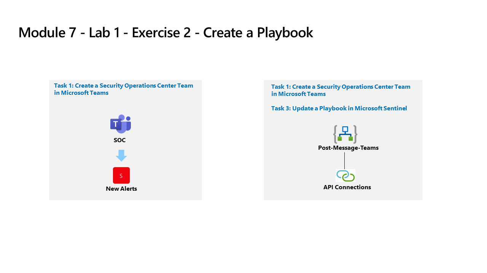

---
lab:
    title: 'Exercise 2 - Create a Playbook'
    module: 'Module 7 - Create detections and perform investigations using Microsoft Sentinel'
---

# Module 7 - Lab 1 - Exercise 2 - Create a Playbook

## Lab scenario

You are a Security Operations Analyst working at a company that implemented Microsoft Sentinel. You must learn how to detect and mitigate threats using Microsoft Sentinel. Now, you want to respond and reMediate actions that can be run from Microsoft Sentinel as a routine.

With a playbook, you can help automate and orchestrate your threat response, integrate with other systems both internal and external, and can be set to run automatically in response to specific alerts or incidents, when triggered by an analytics rule or an automation rule, respectively. 

### Task 1: Create a Security Operations Center Team in Microsoft Teams

In this task, you will create a Microsoft Teams team for use in the lab.

1. Log in to WIN1 virtual machine as Admin with the password: **Pa55w.rd**.  

1. In the Edge browser, open a new tab and navigate to the Microsoft Teams portal at (https://teams.microsoft.com).

1. In the **Sign in** dialog box, copy and paste in the **Tenant Email** account provided by your lab hosting provider and then select **Next**.

1. In the **Enter password** dialog box, copy and paste in the **Tenant Password** provided by your lab hosting provider and then select **Sign in**.

1. Close any Teams pop-ups that may appear.

1. If not already selected, select **Teams** on the left menu, then at the bottom, select **Join or create a team**.

1. Select the **Create Team** button in the main window.

1. Select the **From scratch** button.

1. Select the **Private** button.

1. Give the team the name: type **SOC** and select the **Create** button.

1. In the Add members to SOC screen, select the **Skip** button. 

1. Scroll down the Teams blade to locate the newly created SOC team, select the ellipsis **(...)** on the right side of the name and select **Add channel**.

1. Enter a channel name of *New Alerts* then select the **Add** button.

### Task 2: Create a Playbook in Microsoft Sentinel

In this task, you will create a Logic App that will be used as a Playbook in Microsoft Sentinel.

1. In the Edge browser, navigate to the Azure portal at https://portal.azure.com.

1. In the **Sign in** dialog box, copy and paste in the **Tenant Email** account provided by your lab hosting provider and then select **Next**.

1. In the **Enter password** dialog box, copy and paste in the **Tenant Password** provided by your lab hosting provider and then select **Sign in**.

1. In the Search bar of the Azure portal, type *Sentinel*, then select **Microsoft Sentinel**.

1. Select your Microsoft Sentinel Workspace you created earlier.

1. Select the **Community** page under the *Content management* area on the left side of the page.

1. On the right pane, select the **Onboard community content** link. This will open a new tab in the Edge Browser for Microsoft Sentinel GitHub content.

1. Select the **Solutions** folder.

1. Next select the **SentinelSOARessentials** folder, then the **Playbooks** folder.

1. Select the **Post-Message-Teams** folder.

1. In the readme.md box, scroll down to the second *Quick Deployment* option, **Deploy with alert trigger** and select the **Deploy to Azure** button.  

    >**VERY IMPORTANT**: Be aware that they are two different Microsoft Sentinel triggers to use, Incident and Alert. Make sure you are selecting the Alert (second) one.

1. Make sure your Azure Subscription is selected.

1. For Resource Group, select **Create New**, enter *RG-Playbooks* and select **OK**.

1. Leave **(US) East US** as the default value for *Region*.

1. Make sure the *Playbook Name* is "PostMessageTeams-OnAlert" and select **Review + create**. **Hint:** If the name is different, go back to GitHub and select the **Deploy with alert trigger** playbook.

1. Now select **Create**. 

    >**Note:** Wait for the deployment to finish before proceeding to the next task.

### Task 3: Update a Playbook in Microsoft Sentinel

In this task, you will update the new playbook you created with the proper connection information.

1. In the Search bar of the Azure portal, type *Sentinel*, then select **Microsoft Sentinel**.

1. Select your Microsoft Sentinel Workspace.

1. Select the **Automation** under the *Configuration* area and then select the **Active Playbooks** tab.

1. Select the **PostMessageTeams-OnAlert** playbook. **Hint:** If you do not see the playbook, refresh the Azure portal page by pressing Ctrl+F5.

1. On the Logic App page for *PostMessageTeams-OnAlert*, in the command menu, select **Edit**.

1. Select the *first* block, **Microsoft Sentinel alert**.

1. Select the **Change connection** link.

1. Select **Add new** and select **Sign in**. In the new window, select your Azure subscription admin credentials when prompted. The last line of the block should now read "Connected to your-admin-username".

1. Now select the *second* block, **Alert - Get incident**.

1. Select the **Change connection** link.

1. Select the connection that has your Azure admin username under *Display Name*. **Hint:** admin@ZZZZZZ.onmicrosoft.com. The last line of the block should now read "Connected to your-admin-username".

1. Now select the *third* block, **Connections**.

1. Select **Add new** and select your Azure admin credentials when prompted. The last line of the block should now read "Connected to your-admin-username".

1. The block has now been renamed to **Post a message (V3)**, at the end of the *Team* field, select the **X** to clear the contents. The field will be changed to a drop-down with a listing of the available Teams from Microsoft Teams. Select **SOC**.

1. Do the same for the *Channel* field, select the **X** at the end of the field to clear the contents. The field will be changed to a drop-down with a listing of the Channels of the SOC Teams. Select **New Alerts**.

1. Select **Save** on the command bar.

The Logic App will be used in a future lab.

## Proceed to Exercise 3
