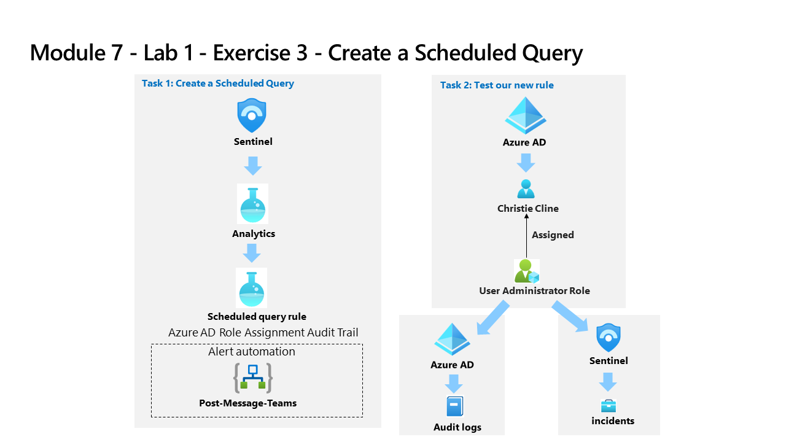

---
lab:
    title: 'Exercise 3 - Create a Scheduled Query from a template'
    module: 'Learning Path 7 - Create detections and perform investigations using Microsoft Sentinel'
---

# Learning Path 7 - Lab 1 - Exercise 3 - Create a Scheduled Query from a template

## Lab scenario

You are a Security Operations Analyst working at a company that implemented Microsoft Sentinel. You must learn how to detect and mitigate threats using Microsoft Sentinel. After connecting your data sources to Microsoft Sentinel, you create custom analytics rules to help discover threats and anomalous behaviors in your environment.

Analytics rules search for specific events or sets of events across your environment, alert you when certain event thresholds or conditions are reached, generate incidents for your SOC to triage and investigate, and respond to threats with automated tracking and reMediation processes.

### Task 1: Create a Scheduled Query

In this task, you will create a scheduled query and connect it to the Teams channel you created in the previous exercise.

1. Log in to WIN1 virtual machine as Admin with the password: **Pa55w.rd**.  

1. In the **Sign in** dialog box, copy and paste in the **Tenant Email** account provided by your lab hosting provider and then select **Next**.

1. In the **Enter password** dialog box, copy and paste in the **Tenant Password** provided by your lab hosting provider and then select **Sign in**.

1. In the Search bar of the Azure portal, type *Sentinel*, then select **Microsoft Sentinel**.

1. Select your Microsoft Sentinel Workspace.

1. Select **Analytics** from the Configuration area.

1. Make sure that you are in the *Rule templates* tab in the command bar and search for the **New CloudShell User** rule.

1. From the rule summary blade, make sure you are receiving data by checking the green connected icon under *Data source*.

    >**Note:** If you do not see it in a connected state, make sure you completed Task 3 of the Learning Path 6 Lab, Exercise 01.

1. Select **Create rule** to continue.

1. In the Analytics rule wizard, on the *General* tab, change the *Severity* to **Medium**.

1. Select **Next: Set rule logic >** button:

1. For the rule query, select **View query results**. You should not receive any results nor any errors.

1. Close the *Logs* window by selecting the upper right **X** and select **OK** to discard to save changes to go back to the wizard.

1. Scroll down and under *Query scheduling* set the following:

    |Setting|Value|
    |---|---|
    |Run Query every|5 minutes|
    |Look data from the last|1 Days|

    >**Note:** We are purposely generating many incidents for the same data. This enables the Lab to use these alerts.

1. Under the *Alert threshold* area, leave the value unchanged since we want the alert to register every event.

1. Under the *Event grouping* area, leave the **Group all events into a single alert** as the selected option since we want to generate a single alert every time it runs, as long as the query returns more results than the specified alert threshold above.

1. Select the **Next: Incident settings >** button. 

1. On the *Incident settings* tab, review the default options.

1. Select the **Next: Automated response >** button.

1. On the *Automated response* tab under *Automation rules*, select **Add new**.

1. For the *Automation rule name*, enter **Tier 2**.

1. For the *Actions*, select **Assign owner**.

1. Then select **Assign to me**. Then select **Apply**.

1. Scroll down and select the **Alert automation (classic)** bar

1. From the drop-down menu, select the playbook **PostMessageTeams-OnAlert** you had created in the previous exercise.

1. Select the **Next: Review >** button.
  
1. Select **Create**.

### Task 2: Test our new rule

In this task, you will test your new scheduled query rule.

1. In the top bar of the Azure Portal, Select the icon **>_** that corresponds to the Cloud Shell. You might need to select the ellipsis icon first **(...)** if your display resolution is too low.

1. Select **Powershell** and then **Create storage**. Wait until the Cloud Shell is provisioned.

1. In the Search bar of the Azure portal, type *Activity* and then select **Activity Log**.

1. Make sure the following *Operation name* items appear: **List Storage Account Keys** and **Update Storage Account Create**. These are the operations that the KQL query you reviewed earlier will match to generate the alert. **Hint:** You might need to select **Refresh** to update the list.

1. In the Search bar of the Azure portal, type *Sentinel*, then select **Microsoft Sentinel**.

1. Select your Microsoft Sentinel Workspace.

1. Select the **Incidents** menu option under *Threat management*.

1. Select the **Auto-refresh incidents** toggle.

1. You should see the newly created Incident. 

    >**Note:** The event that triggers the alert may take 5+ minutes to process. Continue with the next exercise, you will come back to this view later.

1. Select the Incident and review the information in the right blade.

1. Go back to Microsoft Teams by selecting the tab in your Edge browser. If you closed it, just open a new tab and type https://teams.microsoft.com. Go to the *SOC* Teams, select the *New Alerts* channel and see the message post about the incident.

## Proceed to Exercise 4
