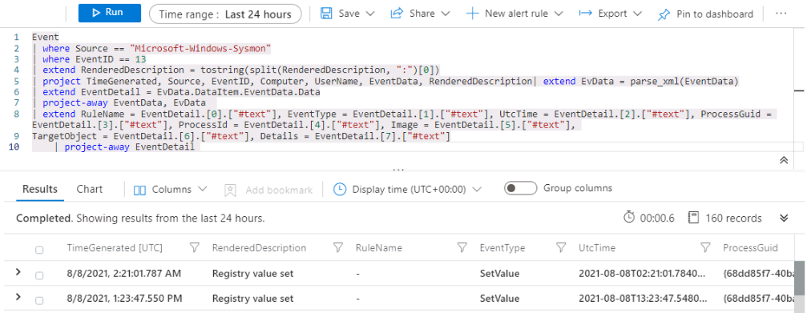

---
lab:
    title: 'Exercise 6 - Create Detections'
    module: 'Module 7 - Create detections and perform investigations using Microsoft Sentinel'
---

# Module 7 - Lab 1 - Exercise 6 - Create Detections


### Task 1: Attack 1 Detection with Sysmon

In this task, you will create a detection for **Attack 1** on the host with the Security Events connector and Sysmon installed.

1. Login to WIN1 virtual machine as Admin with the password: **Pa55w.rd**.  

2. In the Edge browser, navigate to the Azure portal at https://portal.azure.com.

3. In the **Sign in** dialog box, copy and paste in the **Tenant Email** account for admin provided by your lab hosting provider and then select **Next**.

4. In the **Enter password** dialog box, copy and paste in the **Tenant Password** for admin provided by your lab hosting provider and then select **Sign in**.

5. In the Search bar of the Azure portal, type *Sentinel*, then select **Microsoft Sentinel**.

6. Select your Microsoft Sentinel Workspace you created earlier.

7. Select **Logs** from the General section.

8. First, you need to see where the data is stored. Since you just performed the attacks.  Set the Log Time Range to **Last 24 hours**.

9. Run the following KQL Statement

```KQL
search "temp\\startup.bat"
```

10. The results show data for three different tables:
    - DeviceProcessEvents
    - DeviceRegistryEvents
    - Event

    The *Device* tables are from Defender for Endpoint connector and *Event* table populates data from the Sysmon/Operational Windows Event Logs connected through the Agents configuration.

    Since we are receiving data from two different sources - Sysmon and Defender for Endpoint, we will need to build two KQL statements that could union later. In our initial investigation, you will look at each separately.

    >**Note:** On rare occasions the data loading process may take longer than normal. When that happens, the tables may not appear in the query for some hours. You may continue now if you only see the *Event* table.

11. Our first data source is Sysmon from Windows hosts.  Run the following KQL Statement.

```KQL
search in (Event) "temp\\startup.bat"
```

The results now only show for the Event table.  

12. Expand the rows to see all the columns related to the record.  A few of the fields like EventData and ParameterXml have multiple data items stored as structured data.  This makes it difficult to query on specific fields.  

13. Next, we have to build a KQL statement that parses the data from each row, allowing us to have meaningful fields. In the Microsoft Sentinel Community on GitHub, there are many examples of Parsers in the Parsers folder.  Open another tab in your browser and navigate to: **https://github.com/Azure/Azure-Sentinel**

14. Select the **Parsers** folder, then **Sysmon** folder.

15. Select the Sysmon-v12.0.txt file to view.

    At the top of the file, you see a Let statement querying the Event table and storing to a variable named EventData.
    >**Hint:** The following code snippet is for better understanding the query in step 16, not to be copied and executed.

```
let EventData = Event
| where Source == "Microsoft-Windows-Sysmon"
| extend RenderedDescription = tostring(split(RenderedDescription, ":")[0])
| project TimeGenerated, Source, EventID, Computer, UserName, EventData, RenderedDescription
| extend EvData = parse_xml(EventData)
| extend EventDetail = EvData.DataItem.EventData.Data
| project-away EventData, EvData  ;
```

Further down in the file, you see another let statement looking at EventID == 13 and using the EventData variable as input.
>**Hint:** The following code snippet is for better understanding the query in step 16, not to be copied and executed.

```
let SYSMON_REG_SETVALUE_13=()
{
    let processEvents = EventData
    | where EventID == 13
    | extend RuleName = EventDetail.[0].["#text"], EventType = EventDetail.[1].["#text"], UtcTime = EventDetail.[2].["#text"], ProcessGuid = EventDetail.[3].["#text"], 
    ProcessId = EventDetail.[4].["#text"], Image = EventDetail.[5].["#text"], TargetObject = EventDetail.[6].["#text"], Details = EventDetail.[7].["#text"]
    | project-away EventDetail  ;
    processEvents;
    
};
```

16. This looks like a good start. With the two statements above, you create your own KQL statement to display all Registry Key Set Value rows using Sysmon within the Event table. Run the following KQL query:

    >**Important:** Please paste any KQL queries first in *Notepad* and then copy from there to the *New Query 1* Log window to avoid any errors.

```KQL
Event
| where Source == "Microsoft-Windows-Sysmon"
| where EventID == 13
| extend RenderedDescription = tostring(split(RenderedDescription, ":")[0])
| project TimeGenerated, Source, EventID, Computer, UserName, EventData, RenderedDescription
| extend EvData = parse_xml(EventData)
| extend EventDetail = EvData.DataItem.EventData.Data
| project-away EventData, EvData  
| extend RuleName = EventDetail.[0].["#text"], EventType = EventDetail.[1].["#text"], UtcTime = EventDetail.[2].["#text"], ProcessGuid = EventDetail.[3].["#text"], 
    ProcessId = EventDetail.[4].["#text"], Image = EventDetail.[5].["#text"], TargetObject = EventDetail.[6].["#text"], Details = EventDetail.[7].["#text"]
    | project-away EventDetail 
```

   

17. You could continue to build your detection rule from here, but this KQL statement looks like it could be reused in other detection rule's KQL statements.  In the Log window, select **Save**, then **Save as function**. In the Save flyout, enter the following and save the function:

    |Setting|Value|
    |---|---|
    |Function Name|**Event_Reg_SetValue**|
    |Category|**Sysmon**|

18. Select **Save** and open a new Log Query tab by selecting the '+' sign. Then run the following KQL Statement:

```KQL
Event_Reg_SetValue
```

19. Depending on the current data collection, you could receive many rows. This is expected. Our next task is to filter to our specific scenario. Run the following KQL Statement to return our specific record that we can now review to see what we can change to identify rows:

```KQL
Event_Reg_SetValue | search "startup.bat"
```

20. From our Threat Intelligence, we know that the Threat Actor is using reg.exe to add the registry key.  The directory is c:\temp. The startup.bat can be a different name. Run the following script

```KQL
Event_Reg_SetValue 
| where Image contains "reg.exe"
```

21. This is a good start.  Next, you need to return results only for c:\temp directory. Next, enter the following KQL statement:

```KQL
Event_Reg_SetValue 
| where Image contains "reg.exe"
| where Details startswith "C:\\TEMP"
```

22. It is important to help the Security Operations Analyst by providing as much context about the alert as you can. This includes projecting entities for use in the investigation graph.  Run the following query:

```KQL
Event_Reg_SetValue 
| where Image contains "reg.exe"
| where Details startswith "C:\\TEMP"
| extend timestamp = TimeGenerated, HostCustomEntity = Computer, AccountCustomEntity = UserName

```

23. Now that you have a good detection rule, in the Log window with the query, select the **+ New alert rule** in the Command Bar, and choose **Create Azure Sentinel alert**.

24. This starts our Analytics rule wizard. For the General Tab enter:

    |Setting|Value|
    |---|---|
    |Name|**Sysmon Startup RegKey**|
    |Description|**Sysmon Startup Regkey in c:\temp**|
    |Tactics|**Persistence**|
    |Severity|**High**|

25. Select **Next : Set rule logic >**. On the **Set rule logic** tab, the **Rule query** should already be populated. Select **-> Test with current data** to review the number of alerts you could receive per day with the current configuration.

26. For Query scheduling set the following:

    |Setting|Value|
    |---|---|
    |Run Query every|5 minutes|
    |Look data from the last|1 Day|

    >**Note:** We are purposely generating many incidents for the same data. This enables the Lab to use these alerts. With this configuration change, the number of received alerts might change.  Select **-> Test with current data** to review the number of alerts you could receive per day with the changed configuration.

27. Leave the rest of the options to the defaults.  Select **Next : Incident settings>** button.

28. For the *Incident settings (Preview)* tab, make sure these configurations are set as following: 

    |Setting|Value|
    |---|---|
    |Incident settings|Enabled|
    |Alert grouping|Disabled|

29. Select **Next : Automated response >** button. For the "Automated response" tab select the *PostMessageTeams-OnAlert* under *Alert automation* and then select **Next : Review** button.

30. On the Review tab, select the **Create** button.


### Task 2: Attack 1 Detection with Defender for Endpoint

In this task, you will create a detection for **Attack 1** on the host with the Microsoft Defender for Endpoint configured.

1. In the Microsoft Sentinel portal, Select **Logs** from the General section.

2. First, you need to see where the data is stored. Since you just performed the attacks set the log **Time Range: Last 24 hours**.

3. Run the following KQL Statement:

```KQL
search "temp\\startup.bat"
```

4. The results show data for three different tables:
    - DeviceProcessEvents
    - DeviceRegistryEvents
    - Event

    The *Device* tables are from Defender for Endpoint connector and *Event* table populates data from the Sysmon/Operational Windows Event Logs connected through the Agents configuration.

    Since we are receiving data from two different sources - Sysmon and Defender for Endpoint.  We will need to build two KQL statements that could union later. But our initial investigation, you will look at each separately.

    >**Note:** On rare occasions the data loading process may take longer than normal. When that happens, the tables may not appear in the query for some hours. Continue to Task 3 if you don't see the *Device* tables in the results and come back later to this point.

5. This detection will focus on data from Defender for Endpoint.  Run the following KQL Statement:

```KQL
search in (Device*) "temp\\startup.bat"
```

6. The table - DeviceRegistryEvents looks to have the data already normalized and easy for us to query.  Expand the rows to see all the columns related to the record.

7. From our Threat Intelligence, we know that the Threat Actor is using reg.exe to add the registry key.  The directory is c:\temp. The startup.bat can be a different name.  Enter this KQL statement:

```KQL
DeviceRegistryEvents
| where ActionType == "RegistryValueSet"
| where InitiatingProcessFileName == "reg.exe"
| where RegistryValueData startswith "c:\\temp"
```

8. It is important to help the Security Operations Center Analyst by providing as much context about the alert as you can. This includes projecting Entities for use in the investigation graph. Run the following query:

```KQL
DeviceRegistryEvents
| where ActionType == "RegistryValueSet"
| where InitiatingProcessFileName == "reg.exe"
| where RegistryValueData startswith "c:\\temp"
| extend timestamp = TimeGenerated, HostCustomEntity = DeviceName, AccountCustomEntity = InitiatingProcessAccountName
```

   

9.  Now that you have a good detection rule, in the Log window with the query, select the **+ New alert rule** in the Command Bar.  Then select **Create Azure Sentinel alert**.

10. This starts our Analytics rule wizard. For the General Tab, enter:

    |Setting|Value|
    |---|---|
    |Name|**MDE Startup RegKey**|
    |Description|**MDE Startup Regkey in c:\temp**|
    |Tactics|**Persistence**|
    |Severity|**High**|

11. Select **Next : Set rule logic >** button.

12. On the Set rule logic tab, the **Rule query** should already be populated.

13. For Query scheduling set the following:

    |Setting|Value|
    |---|---|
    |Run Query every|5 minutes|
    |Look data from the last|1 Day|

    >**Note:** We are purposely generating many incidents for the same data.  This enables the Lab to use these alerts.

14. Leave the rest of the options to the defaults.  Select **Next : Incident settings >**:

15. For the *Incident settings (Preview)* set the following: 

    |Setting|Value|
    |---|---|
    |Incident settings|Enabled|
    |Alert grouping|Disabled|

16. Select **Next : Automated response >**. For the "Automated response" tab select the *PostMessageTeams-OnAlert* under *Alert automation* and then select **Next : Review** button.

17. On the Review and create tab, select **Create**.


### Task 3: Attack 2 Detection with SecurityEvent

In this task, you will create a detection for *Attack 2* on the host with the Security Events connector and Sysmon installed.

1. Select **Logs** from the General section of the Microsoft Sentinel portal.

2. First, you need to see where the data is stored. Since you just performed the attacks.  

    Set the Log Time Range to Last 24 hours.

3. Run the following KQL Statement:

```KQL
search "administrators"
```

4. The results show the following tables:
    - Event
    - SecurityEvent

5. Our first data source is SecurityEvent. Time to research what event ID Windows uses to identify adding a member to a privileged group. The EventID and Event that we are looking is "4732 - A member was added to a security-enabled local group". Run the following script to confirm:

```KQL
SecurityEvent
| where EventID == "4732"
| where TargetAccount == "Builtin\\Administrators"
```

6. Expand the rows to see all the columns related to the record.  The username we are looking for doesn't show.  The issue is that instead of storing the username, the security identifier (SID) is stored.  The following KQL will try to match the SID to populate the TargetUserName that was added to the Administrators group.

```KQL
SecurityEvent
| where EventID == "4732"
| where TargetAccount == "Builtin\\Administrators"
| extend Acct = MemberSid, MachId = SourceComputerId 
| join kind=leftouter (
     SecurityEvent 
     | summarize count() by TargetSid, SourceComputerId, TargetUserName
     | project Acct1 = TargetSid, MachId1 = SourceComputerId, UserName1 = TargetUserName
) on $left.MachId == $right.MachId1, $left.Acct == $right.Acct1 
```

   

>**Note:** This KQL might not return the expected results because of the small dataset used in the lab.

7. It is important to help the Security Operations Analyst by providing as much context about the alert as you can. This includes projecting Entities for use in the investigation graph.  Run the following query:

```KQL
SecurityEvent
| where EventID == "4732"
| where TargetAccount == "Builtin\\Administrators"
| extend Acct = MemberSid, MachId = SourceComputerId 
| join kind=leftouter (
     SecurityEvent 
     | summarize count() by TargetSid, SourceComputerId, TargetUserName
     | project Acct1 = TargetSid, MachId1 = SourceComputerId, UserName1 = TargetUserName
) on $left.MachId == $right.MachId1, $left.Acct == $right.Acct1 
| extend timestamp = TimeGenerated, HostCustomEntity = Computer, AccountCustomEntity = UserName1
```

8. Now that you have a good detection rule, in the Log window with the query, select **+ New alert rule** in the Command Bar, then select **Create Azure Sentinel alert**.

9. This starts our Analytics rule wizard. For the General Tab, enter:

    |Setting|Value|
    |---|---|
    |Name|**SecurityEvents Local Administrators User Add**|
    |Description|**User added to Local Administrators group**|
    |Tactics|**Privilege Escalation**|
    |Severity|**High**|

10. Select **Next : Set rule logic >** button. On the Set rule logic tab, the Rule query and Map entities should already be populated.

11. For Query scheduling set the following:

    |Setting|Value|
    |---|---|
    |Run Query every|5 minutes|
    |Look data from the last|1 Day|

    >**Note:** We are purposely generating many incidents for the same data.  This enables the Lab to use these alerts.

12. Leave the rest of the options to the defaults.  Select **Next : Incident settings >**:

13. For the *Incident settings (Preview)* set the following:

    |Setting|Value|
    |---|---|
    |Incident settings|Enabled|
    |Alert grouping|Disabled|

14. Select **Next: Automated response >**. For the "Automated response" tab select the *PostMessageTeams-OnAlert* under *Alert automation* and then select **Next : Review** button.

15. On the Review tab, select **Create**.

## Proceed to Exercise 7
