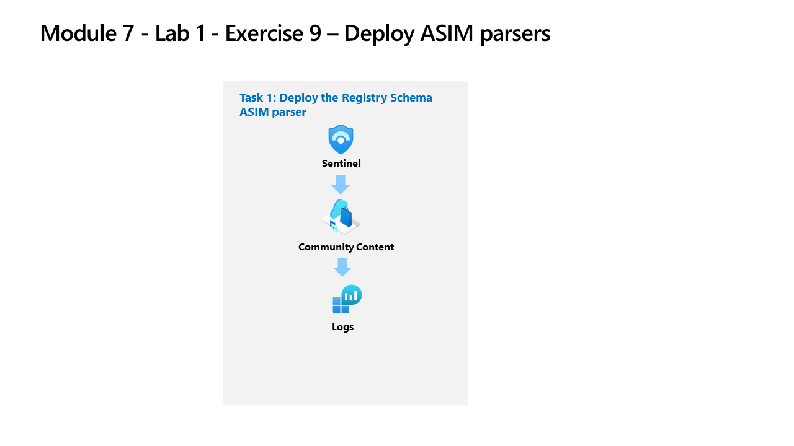

---
lab:
    title: 'Exercise 9 - Create ASIM parsers'
    module: 'Learning Path 7 - Create detections and perform investigations using Microsoft Sentinel'
---

# Learning Path 7 - Lab 1 - Exercise 9 - Deploy ASIM parsers

## Lab scenario

You're a Security Operations Analyst working at a company that implemented Microsoft Sentinel. You need to model ASIM parsers for a specific Windows registry event. These parsers will be finalized at a later time following the [Advanced Security Information Model (ASIM) Registry Event normalization schema reference](https://docs.microsoft.com/en-us/azure/sentinel/registry-event-normalization-schema).

>**Note:** An **[interactive lab simulation](https://mslabs.cloudguides.com/guides/SC-200%20Lab%20Simulation%20-%20Create%20Advanced%20Security%20Information%20Model%20Parsers)** is available that allows you to click through this lab at your own pace. You may find slight differences between the interactive simulation and the hosted lab, but the core concepts and ideas being demonstrated are the same. 

### Task 1: Deploy the Registry Schema ASIM parsers

In this task, you'll review the Registry Schema parsers that are included with the Microsoft Sentinel deployment.

1. Log in to WIN1 virtual machine as Admin with the password: **Pa55w.rd**.  

2. In the Microsoft Edge browser, navigate to the Azure portal at https://portal.azure.com.

3. In the **Sign in** dialog box, copy, and paste in the **Tenant Email** account provided by your lab hosting provider and then select **Next**.

4. In the **Enter password** dialog box, copy, and paste in the **Tenant Password** provided by your lab hosting provider and then select **Sign in**.

5. In the Search bar of the Azure portal, type *Sentinel*, then select **Microsoft Sentinel**.

6. Select your Microsoft Sentinel Workspace you created earlier.

<!--- 1. In the Edge browser, open a new tab (Ctrl+T) and navigate to the Microsoft Sentinel GitHub ASIM page <https://github.com/Azure/Azure-Sentinel/tree/master/ASIM>.

7. On the right pane, select the **Onboard community content** link. This will open a new tab in the Edge Browser for Microsoft Sentinel GitHub content. **Hint:** You might need to scroll right to see the link. Alternatively, follow this link instead: [Microsoft Sentinel on GitHub](https://github.com/Azure/Azure-Sentinel).

    >**Note:** In the **ASIM** folder you can deploy templates that contain all ASIM parsers, but we will only focus on the Registry Schema.

8. Scroll down and next to **Registry Event**, select the **Deploy to Azure** button.

9. For *Resource Group*, select **RG-Defender** where your Sentinel workspace resides.

10. For *Workspace*, type your Sentinel workspace name, like *uniquenameDefender*.

11. Leave the other default values and select **Review + create**.

12. Select **Create** to deploy the template. Notice the Names of the different resources. 

13. After the deployment completes return to the *Microsoft Sentinel* tab. --->

14. Select **Logs** under the *General* left menu.

15. Open the *Schema and Filter* blade by selecting **>>** if needed.

16. Select the **Functions** tab (next to the Tables and Queries tabs). **Hint:** You might need to select the ellipsis icon **(...)** to select the tab.

17. In the *Search* bar type **registry**, and scroll down through the ASIM parser functions until you see the following *_Im_RegistryEvent_MicrosoftWindowsEventxxx*for Microsoft Windows under the *Microsoft Sentinel* heading.

    >**Note:** We're using the xxx in the ASIM parser function name to account for version changes. At the time this lab was updated the function was _Im_RegistryEvent_MicrosoftWindowsEvent*V02*.

18. Hover over the **_Im_RegistryEvent_MicrosoftWindowsEventxxx** ASIM function and then select **Load the function code** in the popup window.

19. Review the KQL that is parsing the Event ID 4657 to simplifying your analysis of the data in the Microsoft Sentinel workspace.

    >**Hint:** Typing ctrl+f in the code window brings up *Find* and makes searching for *EventID: 4657* much easier.

20. Go back to the *Schema and Filter* blade and now hover the **_Im_RegistryEvent_MicrosoftWindowsEventxxx** *Registry Event ASIM filtering parser for Microsoft Windows Events and Security Events* and then select **Use in editor**.

21. **Run** the ASIM function query. You shouldn't get any result nor errors, it's just for validation purposes.

## Proceed to Exercise 10