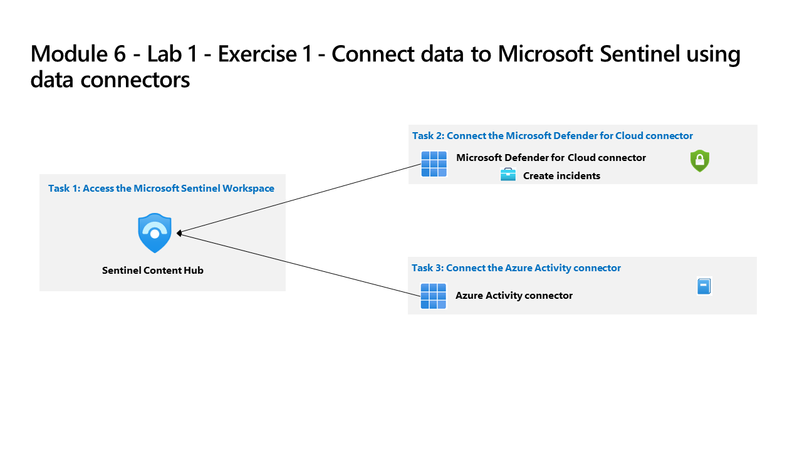

---
lab:
    title: 'Exercise 1 - Connect data to Microsoft Sentinel using data connectors'
    module: 'Learning Path 8 - Connect logs to Microsoft Sentinel'
---

# Learning Path 8 - Lab 1 - Exercise 1 - Connect data to Microsoft Sentinel using data connectors

## Lab scenario

You are a Security Operations Analyst working at a company that implemented Microsoft Sentinel. You must learn how to connect log data from the many data sources in your organization. The organization has data from Microsoft 365, Microsoft 365 Defender, Azure resources, non-azure virtual machines, etc. You start connecting the Microsoft sources first.

>**Important:** The lab exercises for Learning Path #8 are in a *standalone* environment. If you exit the lab before completing it, you will be required to re-run the configurations again.

### Estimated time to complete this lab: 20 minutes

### Task 1: Access the Microsoft Sentinel Workspace

In this task, you will access your Microsoft Sentinel workspace.

>**Note:** Microsoft Sentinel has been predeployed in your Azure subscription with the name **defenderWorkspace**, and the required *Content Hub* solutions have been installed.

1. Log in to **WIN1** virtual machine as Admin with the password: **Pa55w.rd**.  

1. Open the Microsoft Edge browser.

1. In the Edge browser, navigate to the Azure portal at <https://portal.azure.com>.

1. In the **Sign in** dialog box, copy, and paste in the **Tenant Email** account provided by your lab hosting provider and then select **Next**.

1. In the **Enter password** dialog box, copy, and paste in the **Tenant Password** provided by your lab hosting provider and then select **Sign in**.

1. In the Search bar of the Azure portal, type *Sentinel*, then select **Microsoft Sentinel**.

1. Select the Microsoft Sentinel **defenderWorkspace**.

1. Proceed to the next task.

### Task 2: Connect the Microsoft Defender for Cloud data connector

In this task, you will connect the Microsoft Defender for Cloud data connector.

   >**Important:** To *Enable* Bi-directional sync, please rerun  **[Lab 05 Exercise 1](https://microsoftlearning.github.io/SC-200T00A-Microsoft-Security-Operations-Analyst/Instructions/Labs/LAB_AK_05_Lab1_Ex01_Enable_MDC.html)**, Task 2, and select **Setup** from the *Microsoft Defender for Cloud* navigation menu to verify all eligible Azure subscriptions are onboarded.

1. In the Microsoft Sentinel navigation menu, scroll down to the **Content management** section and select **Content Hub**.

1. In the *Content hub*, search for the **Microsoft Defender for Cloud** solution and select it from the list.

1. On the *Microsoft Defender for Cloud* solution details page select **Manage**.

    >**Note:** The *Microsoft Defender for Cloud* solution installs the *Subscription-based Microsoft Defender for Cloud (Legacy)* Data connector, the *Tenant-based Microsoft Defender for Cloud (Preview)* Data connector, and an Analytics rule. The *Tenant-based Microsoft Defender for Cloud (Preview)* Data connector is used when a tenant has multiple subscriptions.

1. Select the *Subscription-based Microsoft Defender for Cloud (Legacy)* Data connector check-box, and select **Open connector page**.

1. In the *Configuration* section, under the *Instructions* tab, **select** the checkbox for the *MOC Subscription-XXXXXXXXXXX* and slide the **Status** option to the right.

1. The *Status* should be now **Connected** and "Bi-directional sync" should be *Enabled*.

    <!--- 1. Scroll down and under the *Create incidents - Recommended!* area, verify that *Create incidents automatically from all alerts generated in this connected service* is **Enabled**. --->

### Task 3: Connect the Azure Activity data connector

In this task, you will connect the *Azure Activity* data connector.

1. In the Microsoft Sentinel navigation menu, scroll down to the *Content management* section and select **Content Hub**.

1. In the *Content hub*, search for the **Azure Activity** solution and select it from the list.

1. On the *Azure Activity* solution details page select **Manage**.

    >**Note:** The *Azure Activity* solution installs the *Azure Activity* Data connector, 12 Analytic rules, 14 Hunting queries and 1 Workbook.

1. Select the *Azure Activity* Data connector and select **Open connector page**.

1. In the *Configuration* area under the *Instructions* tab, scroll down to "2. Connect your subscriptions...", and select **Launch Azure Policy Assignment Wizard>**.

1. In the **Basics** tab, select the ellipsis button (...) under **Scope** and select your *MOC Subscription-XXXXXXXXXXX* subscription from the drop-down list and click **Select**.

1. Select the **Parameters** tab, choose your *uniquenameDefender* workspace from the **Primary Log Analytics workspace** drop-down list. This action will apply the subscription configuration to send the information to the Log Analytics workspace.

1. Select the **Remediation** tab and select the **Create a remediation task** checkbox. This action will apply the policy to existing Azure resources.

1. Select the **Review + Create** button to review the configuration.

1. Select **Create** to finish.

## Proceed to Exercise 2
