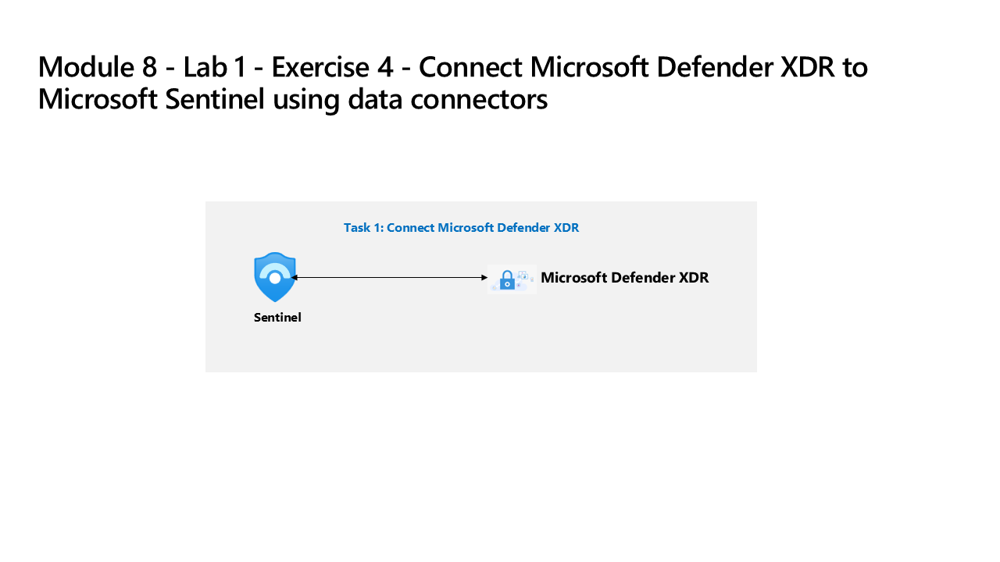

---
lab:
    title: 'Exercise 4 - Connect Defender XDR to Microsoft Sentinel using data connectors'
    module: 'Learning Path 8 - Connect logs to Microsoft Sentinel'
---

# Learning Path 8 - Lab 1 - Exercise 4 - Connect Defender XDR to Microsoft Sentinel using data connectors

## Lab scenario

You're a Security Operations Analyst working at a company that deployed both Microsoft Defender XDR and Microsoft Sentinel. You need to prepare for the Unified Security Operations Platform connecting Microsoft Sentinel to Defender XDR. Your next step will be to install the Defender XDR Content Hub solution and deploy the Defender XDR data connector to Microsoft Sentinel.

>**Note:**
> The environment for this exercise is a simulation generated from the product. As a limited simulation, links on a page may not be enabled and text-based inputs that fall outside of the specified script may not be supported. A pop-up message will display stating, "This feature is not available within the simulation." When this occurs, select OK and continue the exercise steps.

### Task 1: Connect Defender XDR

In this task, you deploy the Microsoft Defender XDR connector.

1. Login to WIN1 virtual machine as Admin with the password: **Pa55w.rd**.  

1. In the Microsoft Edge browser, open the simulated environment by selecting this link: [Azure portal]( https://app.highlights.guide/start/1c894b46-4b0a-40cb-b0f0-1e1c86c615f3?token=16d48b6c-eace-4a1f-8050-098d29d23a89).

1. On the Azure portal *Home* page, select the **Microsoft Sentinel** icon.

1. On the *Microsoft Sentinel* page, select the **Woodgrove-LogAnalyiticWorkspace** Workspace.

1. In the Microsoft Sentinel left menus, scroll down to the **Content management** section and select **Content Hub**.

1. In the *Content hub*, search for the **Microsoft Defender XDR** solution and select it from the list.

1. On the *Microsoft Defender XDR* solution details page, select **Install**.

1. When the installation completes,  search for the **Microsoft Defender XDR** solution and select it.

1. On the *Microsoft Defender XDR* solution details page, select **Manage**

1. Select the *Microsoft Defender XDR* Data connector check-box, and select **Open connector page**.

1. You should see a message that the connection was successful.

### Task 2: Connect Microsoft Sentinel and Microsoft Defender XDR

In this task, you continue with the simulation and connect a Microsoft Sentinel workspace to Microsoft Defender XDR.

1. Navigate back to the Microsoft Sentinel *Content Hub* (using the "breadcrumb" menu link at the top of the page), and select **Overview (Preview)** from the navigation menu General section.

1. Select the **Learn more** button on the *Get your SIEM and XDR in one place* message.

1. Selecting the **Learn more** button opens a new tab in the browser for the *Microsoft Defender XDR* portal.

1. On the **Defender Defender** portal **Home** screen, you should see a banner at the top with the message, *Get your SIEM and XDR in one place*. Select the **Connect a workspaces** button.

1. On the *Choose a workspace* page, select the **woodgrove-loganalyiticsworkspace** Microsoft Sentinel workspace.

1. Select the **Next** button.

1. On the **Set a primary workspace** page, you should see the **woodgrove-loganalyiticsworkspace** Microsoft Sentinel workspace in the drop-down menu. Select the **Next** button.

1. On the *Review and finish* page, verify that the *Workspace* selection is correct and review the bulleted items under the *What to expect when the workspace is connected* section. Select the **Connect** button.

1. You should see a *You're about to connect a workspace* message. Select the **Connect** button.

1. You should now be on the *Workspace successfully connected* page.

1. Select the **Close** button.

1. On the **Defender XDR** portal **Home** screen, you should see a banner at the top with the message, *Your unified SIEM and XDR is ready*. Select the **Start Hunting** button.

1. In *Advanced hunting*, you should see a message to "Explore your content from Microsoft Sentinel". In the *Advanced hunting* navigation menu, you can find the *Microsoft Sentinel* tables, functions, and queries under the corresponding tabs.

1. Scroll down under the **Schema** tab to the **Microsoft Sentinel** heading, and then double-click the **ThreatIntelligenceIndicator** table.

1. In the *Query* pane, you should see a (KQL) query that returns threat intelligence indicators. Select the **Run query** button.

1. You should see results returned in the *Results* pane.

1. Expand the left main menu pane if collapsed and  expand the new **Microsoft Sentinel** menu items. You should see *Search*, *Threat management*, *Content management*, and *Configuration* selections.

    >**Note:** Be aware that there are capability differences between the azure Microsoft Sentinel portal and Sentinel in the Microsoft Defender XDR portal **[Portal capability differences](https://learn.microsoft.com/azure/sentinel/microsoft-sentinel-defender-portal#capability-differences-between-portals)**.

1. From the Microsoft Defender XDR **Microsoft Sentinel** menu items, then select **Configuration** and then **Data connectors**.

1. In the *Data connectors* page, you should see the **Azure Activity** and other data connectors listed with a status of **Connected**.

>**Note:** Feel free to explore and compare the other Microsoft Sentinel capabilities, but as this is a simulation, your ability to explore Microsoft Sentinel in the Microsoft Defender portal is limited. In a real environment, you would be able to explore the full Microsoft Sentinel capabilities in the Microsoft Defender portal..

## You completed the lab - Please proceed to Learning Path 9 - Lab 1 - Exercise 1 - Modify a Microsoft Security rule
