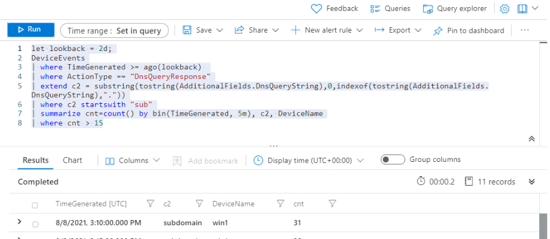

---
lab:
    title: 'Exercise 1 - Perform Threat Hunting in Microsoft Sentinel'
    module: 'Module 8 - Perform threat hunting in Microsoft Sentinel'
---

# Module 8 - Lab 1 - Exercise 1 - Perform Threat Hunting in Microsoft Sentinel

## Lab scenario


You are a Security Operations Analyst working at a company that implemented Microsoft Sentinel. You have received threat intelligence about a Command and Control (C2 or C&C) technique. You need to perform a hunt and watch for the threat.

>**Important:** The log data used in the lab was created in the previous module. See **Attack 3** on WIN1 server in Exercise 5.

>**Note:** Because you already experienced the process of exploring data in a previous module, this lab provides a KQL statement to start with. 


### Task 1: Create a hunting query

In this task, you will create a hunting query, bookmark a result, and create a Livestream.

1. Log in to WIN1 virtual machine as Admin with the password: **Pa55w.rd**.  

1. In the Edge browser, navigate to the Azure portal at https://portal.azure.com.

1. In the **Sign in** dialog box, copy and paste in the **Tenant Email** account provided by your lab hosting provider and then select **Next**.

1. In the **Enter password** dialog box, copy and paste in the **Tenant Password** provided by your lab hosting provider and then select **Sign in**.

1. In the Search bar of the Azure portal, type *Sentinel*, then select **Microsoft Sentinel**.

1. Select your Microsoft Sentinel Workspace.

1. Select **Logs** 

1. Enter the following KQL Statement in the *New Query 1* space:

   >**Important:** Please paste any KQL queries first in Notepad and then copy from there to the *New Query 1* Log window to avoid any errors.

    ```KQL
    let lookback = 2d;
    DeviceEvents | where TimeGenerated >= ago(lookback) 
    | where ActionType == "DnsQueryResponse"
    | extend c2 = substring(tostring(AdditionalFields.DnsQueryString),0,indexof(tostring(AdditionalFields.DnsQueryString),"."))
    | where c2 startswith "sub"
    | summarize count() by bin(TimeGenerated, 3m), c2
    | where count_ > 5
    | render timechart 
    ```

    

1. The goal of the previous KQL query is to provide a visualization for a C2 beaconing on a consistent basis. Adjust grouping of values by changing the *3m* setting to **30s** within bin() and **Run** the query again.

1. Change it back to *3m*. Now change the *count_* threshold to **10** and **Run** the query again to witness the impact.

1. You have now identified DNS requests that are beaconing to a C2 server. Next, determine which devices are beaconing. **Run** the following KQL Statement:

    ```KQL
    let lookback = 2d;
    DeviceEvents | where TimeGenerated >= ago(lookback) 
    | where ActionType == "DnsQueryResponse"
    | extend c2 = substring(tostring(AdditionalFields.DnsQueryString),0,indexof(tostring(AdditionalFields.DnsQueryString),".")) 
    | where c2 startswith "sub"
    | summarize cnt=count() by bin(TimeGenerated, 5m), c2, DeviceName
    | where cnt > 15
    ```

    

    >**Note:** The generated log data is only from the WIN1 device.

1. Close the *Logs* window by selecting the **X** in the top-right of the window and select **OK** to discard the changes. 

1. Select your Microsoft Sentinel workspace again and select the **Hunting** page under the Threat Management area.

1. Select **+ New Query** from the command bar.

1. In the *Create custom query* window, for the *Name* type **C2 Hunt**

1. For the *Custom query* enter the following KQL statement:

    ```KQL
    let lookback = 2d;
    DeviceEvents | where TimeGenerated >= ago(lookback) 
    | where ActionType == "DnsQueryResponse"
    | extend c2 = substring(tostring(AdditionalFields.DnsQueryString),0,indexof(tostring(AdditionalFields.DnsQueryString),"."))
    | where c2 startswith "sub"
    | summarize cnt=count() by bin(TimeGenerated, 5m), c2, DeviceName
    | where cnt > 15
    ```

1. Scroll down and under *Entity mapping (Preview)* select:

    - For the *Entity type* drop-down list select **Host**.
    - For the *Identifier* drop-down list select **HostName**.
    - For the *Value* drop-down list select **DeviceName**.

1. Scroll down and under *Tactics & Techniques* select **Command and Control** and then select **Create** to create the hunting query.

1. In the *"Microsoft Sentinel - Hunting"* blade, search for the query you just created in the list, *C2 Hunt*.

1. Select **C2 Hunt** from the list.

1. On the right pane, scroll down and select the **Run Query** button.

1. The number of results is shown in the middle pane under the *Results* column. Alternatively, scroll up to see the count over the *Results* box.

1. Select the **View Results** button. The KQL query will automatically run.

1. Select the checkbox of the first row in the results. 

1. In the middle command bar, select the **Add bookmark** button.

1. Review the values populated by default and in the *Add bookmark* blade, select **Create**.

1. Close the *Logs* window by selecting the **X** in the top-right of the window and select **OK** to discard the changes. 

1. Back in the Hunting page in the Microsoft Sentinel portal, select the **Bookmarks** tab in the middle pane.

1. Select the **C2 Hunt** bookmark you just created from the results list.

1. On the right pane, scroll down and select the **Investigate** button. **Hint:** It might take a couple of minutes to show the investigation graph.

1. Explore the Investigation graph just like you did in the previous module.

1. Close the *Investigation* graph window by selecting the **X** in the top-right of the window and select **OK** to discard the changes. 

1. Select the **Queries** tab.

1. Search again for and select your **C2 Hunt** query.

1. Right-click your query and select **Add to livestream**. **Hint:** This also can be done by sliding right and selecting the ellipsis **(...)** at the end of the row to open a context menu.

1. Review that the *Status* is now *Running*. You will receive a notification in the Azure Portal (bell icon) if we find a result.


### Task 2: Create a NRT query rule

In this task, instead of using a LiveStream, you will create a NRT analytics query rule. NRT rules run every minute and lookback one minute.  The benefit to NRT rules are they can use the alert and incident creation logic.


1. Select the **Analytics** page in Microsoft Sentinel. 

1. Select the **Create** tab, then **NRT query rule**
1. This starts the "Analytics rule wizard". For the *General* tab type:

    |Setting|Value|
    |---|---|
    |Name|**NRT C2 Hunt**|
    |Description|**NRT C2 Hunt**|
    |Tactics|**Command and Control**|
    |Severity|**High**|

1. Select **Next: Set rule logic >** button. 


1. For the *Rule query* enter the following KQL statement:

    ```KQL
    let lookback = 2d;
    DeviceEvents | where TimeGenerated >= ago(lookback) 
    | where ActionType == "DnsQueryResponse"
    | extend c2 = substring(tostring(AdditionalFields.DnsQueryString),0,indexof(tostring(AdditionalFields.DnsQueryString),"."))
    | where c2 startswith "sub"
    | summarize cnt=count() by bin(TimeGenerated, 5m), c2, DeviceName
    | where cnt > 15
    ```

>**Note:** We are purposely generating many incidents for the same data. This enables the Lab to use these alerts.

1. Leave the rest of the options with the defaults. Select **Next: Incident settings>** button.

1. For the *Incident settings* tab, leave the default values and select **Next: Automated response >** button.

1. For the *Automated response* tab select the **PostMessageTeams-OnAlert** under *Alert automation* and then select **Next: Review** button.

1. On the *Review* tab, select the **Create** button to create the new Scheduled Analytics rule.


### Task 3: Create a Search

In this task, you will use a Search job to look for a C2. 


1. Select the **Search** page in Microsoft Sentinel. 

1. Select the **Restore** tab.

>**Note:** The lab will not have Archived tables to restore from.  The normal process would restore archived tables to include in the Search job.
1. Select the **Cancel**.
1. Select the **Search** tab.
1. Select the *Table* and change to **DeviceRegistryEvents**
1. In the Search box, enter **reg.exe**  
1. Select **Saved Searches**. 
1. The search job will create a new table named **DeviceRegistryEvents_####_SRCH**. 
1. Wait for the search job to complete.  The status will display *Updating*. Then *In progress*. Then *Search completed*. 
1. Select **View search results**
1. Open a new tab in *Logs*.
1. Enter the new table name **DeviceRegistryEvents_####_SRCH** and Run.

## Proceed to Exercise 2
