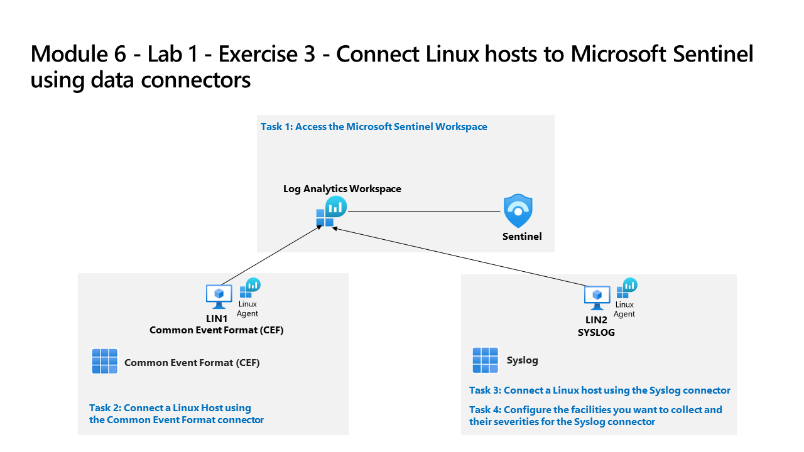
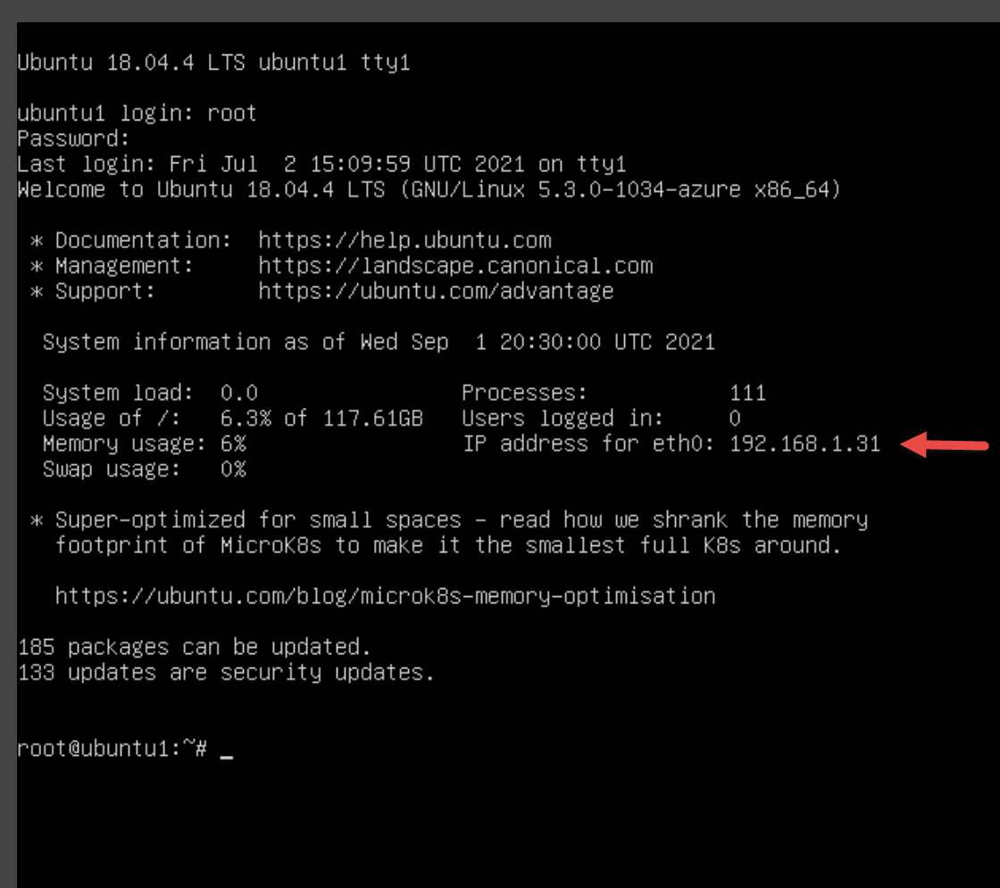
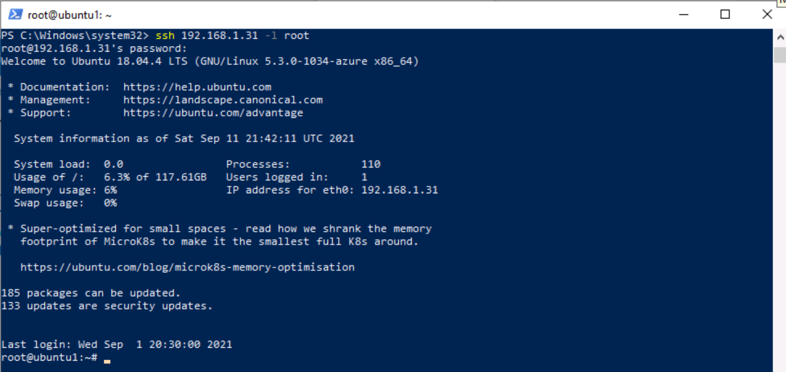
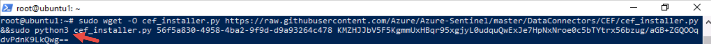
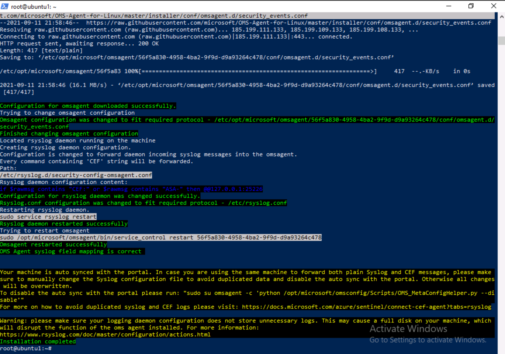

---
lab:
    title: 'Exercise 3 - Connect Linux hosts to Microsoft Sentinel using data connectors'
    module: 'Learning Path 8 - Connect logs to Microsoft Sentinel'
---

# Learning Path 8 - Lab 1 - Exercise 3 - Connect Linux hosts to Microsoft Sentinel using data connectors

## Lab scenario



You are a Security Operations Analyst working at a company that implemented Microsoft Sentinel. You must learn how to connect log data from the many data sources in your organization. The next source of data are Linux virtual machines using the Common Event Formatting (CEF) via Legacy Agent and Syslog connectors.

>**Note:** An **[interactive lab simulation](https://mslabs.cloudguides.com/guides/SC-200%20Lab%20Simulation%20-%20Connect%20Linux%20hosts%20to%20Microsoft%20Sentinel%20using%20data%20connectors)** is available that allows you to click through this lab at your own pace. You may find slight differences between the interactive simulation and the hosted lab, but the core concepts and ideas being demonstrated are the same.

>**Important:** There are steps within the next Tasks that are done in different virtual machines. Look for the Virtual Machine name references.

### Task 1: Access the Microsoft Sentinel Workspace

In this task, you will access your Microsoft Sentinel workspace.

1. Log in to **WIN1** virtual machine as Admin with the password: **Pa55w.rd**.  

1. Start the Microsoft Edge browser.

1. In the Edge browser, navigate to the Azure portal at https://portal.azure.com.

1. In the **Sign in** dialog box, copy, and paste in the **Tenant Email** account provided by your lab hosting provider and then select **Next**.

1. In the **Enter password** dialog box, copy, and paste in the **Tenant Password** provided by your lab hosting provider and then select **Sign in**.

1. In the Search bar of the Azure portal, type *Sentinel*, then select **Microsoft Sentinel**.

1. Select your Microsoft Sentinel Workspace you created in a previous lab.


### Task 2: Connect a Linux Host using the Common Event Format connector

In this task, you will connect a Linux host to Microsoft Sentinel with the Common Event Format (CEF) via Legacy Agent connector.

1. In the Microsoft Sentinel left menus, scroll down to the *Content management* section and select **Content Hub**.

1. In the *Content hub*, search for the **Common Event Format** solution and select it from the list.

1. On the *Common Event Format* solution page select **Install**.

1. When the installation completes select **Manage**

    >**Note:** The *Common Event Format* solution installs both the *Common Events Format (CEF) via AMA* and the *Common Events Format (CEF)* Data connectors.

1. Select the *Common Events Format (CEF) via AMA* Data connector, and select **Open connector page** on the connector information blade.

1. In the *Configuration* section, under the *Instructions* tab, copy to the clipboard the command shown in *1.2 Install the CEF collector on the Linux machine*.

1. Launch your **LIN1** virtual machine. Login with the username and password provided by your lab hoster. **Hint:** You might need to press the Enter key to see the login prompt. 

1. Note the IP address for your LIN1 server. See the screenshot below as an example:

    

1. Go back to the **WIN1** virtual machine. Launch Windows PowerShell as Administrator by right-clicking the Start menu icon and select **Windows PowerShell (Admin)**. Select **Yes** to allow the app to run in the User Account Control window that appears. **Hint:** You might have a Windows PowerShell window already open from previous exercises.

1. Enter the following PowerShell command, adjusting for your specific Linux server information, and press enter:

    ```PowerShell
    ssh insert-your-linux-IP-address-here -l insert-linux-user-name-here
    ```

1. Enter *yes* to confirm the connection and then type the user's password and press enter. Your screen should look something like this:

    

1. You are now ready to paste the *1.2 Install the CEF collector on the Linux machine* command from the earlier step. Make sure that script from Azure is in the clipboard. In PowerShell right-click the top bar and choose **Edit** and then **Paste**. 

1. Once pasted and before to press Enter, add the character **3** to the word *python* as shown below:

    


1. Once the script is adjusted press Enter. The script will run against your Linux server remotely. When the script processes properly it should look like this screen:

    

1. Type **exit** to close the remote shell connection to LIN1.


### Task 3: Connect a Linux host using the Syslog connector

In this task, you will connect a Linux host to Microsoft Sentinel with the Syslog connector.

1. Go back to the Microsoft Edge browser where you have your Microsoft Sentinel Portal open and close the "Common Event Format (CEF) via Legacy Agent" data connector page by selecting the 'x' in the top right corner.

1. In the Microsoft Sentinel left menus, scroll down to the *Content management* section and select **Content Hub**.

1. In the *Content hub*, search for the **Syslog** solution and select it from the list.

1. On the *Syslog* solution page select **Install**.

1. When the installation completes select **Manage**

    >**Note:** The *Syslog* solution installs the *Syslog* Data connector, 5 Analytics rules, 9 Hunting queries, and 1 Workbook.

1. Select the *Syslog* Data connector, and select **Open connector page** on the connector information blade

1. In the *Configuration* section, expand **Install agent on a non-Azure Linux Machine**.

1. Select the link for **Download & install agent for non-Azure Linux machine**.

    >**Note:** Your Log Analytics workspace should show *2 Windows computers connected*. This corresponds to WINServer and AZWIN01 virtual machines connected earlier.

1. Select the tab for **Linux servers**.

    >**Note:** Your Log Analytics workspace should show *1 Linux computers connected*. This corresponds to LIN1 (ubuntu1) virtual machine connected earlier with the CEF connector.

1. Select **Log Analytics agent instructions**.

1. Copy the command in the *Download and onboard agent for Linux* area to the clipboard.

1. Launch your LIN2 virtual machine. Login with the username as password provided by your lab hoster. **Hint:** You might need to press the Enter key to see the login prompt.

1. Note the IP address for your LIN2 server. See the screenshot below as an example:

    

1. Go back to the **WIN1** virtual machine. Select the Windows PowerShell used in the previous task.

1. Enter the following PowerShell command, adjusting for your specific Linux server information, and press enter:

    ```PowerShell
    ssh insert-your-linux-IP-address-here -l insert-linux-user-name-here
    ```

1. Enter *yes* to confirm the connection and then type the user's password and press enter. Your screen should look something like this:

    

1. You are now ready to paste the *Download and onboard agent for Linux* command from the earlier step. Make sure that script is in the clipboard. In PowerShell right-click the top bar and choose **Edit** and then **Paste**.

1. Once the script is pasted, press Enter. The script will run against your Linux server remotely. Wait

1. When it finished, type **exit** to close the remote shell connection to LIN2.


### Task 4: Configure the facilities you want to collect and their severities for the Syslog connector

In this task, you will configure the Syslog collection facilities.

1. Go back to the Edge browser where you have your Microsoft Sentinel Portal open and close the "Log Analytics workspace" page and the "Syslog" data connector page by selecting the 'x' in the top right corner twice.

1. In Microsoft Sentinel portal, select **Settings** under *Configuration* and then the **Workspace settings** tab.

1. Select **Legacy agents management** under the *Classic* area.

1. Select the **Syslog** tab.

1. Select the **+ Add facility** button.

1. Select **auth** from the drop-down menu for *Facility name*.

1. Select the **+ Add facility** button again.

1. Select **syslog** from the drop-down menu for *Facility name*.

1. Select **Apply** to save your changes.

## Proceed to Exercise 4
