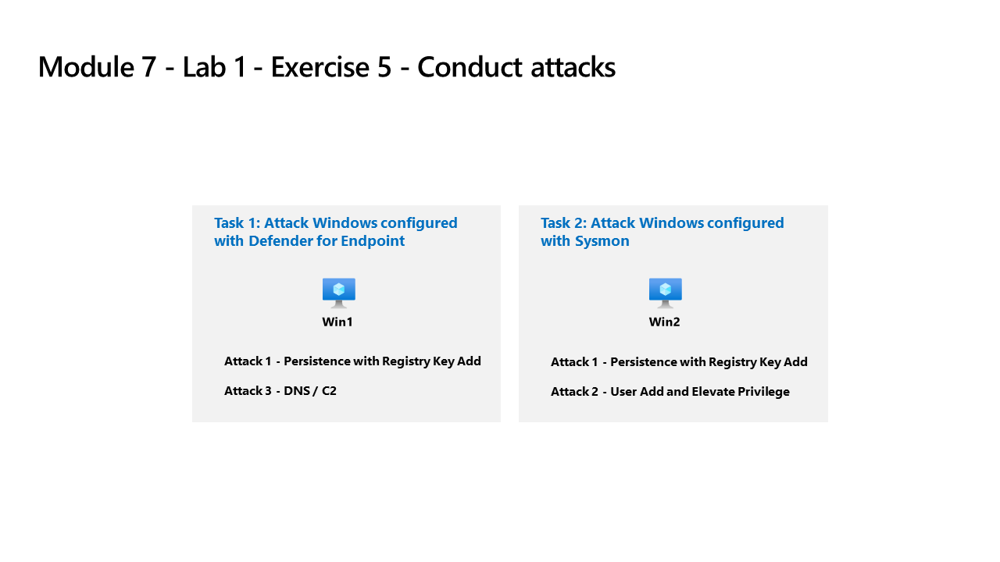

---
lab:
    title: 'Exercise 5 - Prepare to perform simulated attacks'
    module: 'Learning Path 9 - Create detections and perform investigations using Microsoft Sentinel'
---

# Learning Path 9 - Lab 1 - Exercise 5 - Prepare to perform simulated attacks

## Lab scenario



### Estimated time to complete this lab: 30 minutes

### Task 1: Connect an On-Premises Server

In this task, you'll connect an on-premises server to your Azure subscription. Azure Arc was pre-installed on this server. The server will be used in next exercises to run simulated attacks that you will later detect and investigate in Microsoft Sentinel.

>**Note**: The lab exercises for Learning Path #9 are in a *standalone* environment. If you exit the lab before completing it, you will be required to re-run the configurations again.

1. Log in to **WINServer** virtual machine as Administrator with the password: **Passw0rd!** if necessary.  

As described above, Azure Arc has been pre-installed on the **WINServer** machine. You will now connect this machine to your Azure subscription.

1. On the *WINServer* machine, select the *search* icon and type **cmd**.

1. In search results right click *Command Prompt* and select **Run as administrator**.

1. In the Command Prompt window, type the following command. *Do not press enter*:

    ```cmd
    azcmagent connect -g "defender-RG" -l "EastUS" -s "Subscription ID string"
    ```

1. Replace the **Subscription ID string** with the *Subscription ID* provided by your lab hoster (*Resources tab). Make sure to keep the quotes.

1. Type **Enter** to run the command (this may take a couple minutes).

1. In the *Sign in* dialog box, enter your **Tenant Email** and **Tenant Password** provided by your lab hosting provider and select **Sign in**. Wait for the *Authentication complete* message, close the browser tab and return to the *Command Prompt* window.

 >**Note:** If you recieve the *Pick an account* dialog box, select your account, wait for the message that you can close the tab and then go back to the *Command Prompt* window.

1. When the commands complete running, leave the *Command Prompt* window open and type the following command to confirm that the connection was successful:

    ```cmd
    azcmagent show
    ```

1. In the command output, verify that *Agent status* is **Connected**.

## Task 2: Connect a non-Azure Windows Machine

In this task, you'll add an Azure Arc connected, on-premises machine to Microsoft Sentinel.  

>**Note:** Microsoft Sentinel has been predeployed in your Azure subscription with the name **defenderWorkspace**, and the required *Content Hub* solutions have been installed.

1. Login to **WIN1** virtual machine as Admin with the password: **Pa55w.rd**.  

1. In the Microsoft Edge browser, navigate to the Azure portal at <https://portal.azure.com>.

1. In the **Sign in** dialog box, copy, and paste in the **Tenant Email** account provided by your lab hosting provider and then select **Next**.

1. In the **Enter password** dialog box, copy, and paste in the **Tenant Password** provided by your lab hosting provider and then select **Sign in**.

1. In the Search bar of the Azure portal, type *Sentinel*, then select **Microsoft Sentinel**.

1. Select the Microsoft Sentinel **defenderWorkspace**.

1. In the Microsoft Sentinel left navigation menu, scroll down to the *Configuration* section and select **Data connectors**.

1. In the *Data connectors*, search for the **Windows Security Events via AMA** solution and select it from the list.

1. On the *Windows Security Events via AMA* details pane, select **Open connector page**.

    >**Note:** The *Windows Security Events* solution installs both the *Windows Security Events via AMA* and the *Security Events via Legacy Agent* Data connectors. Plus 2 Workbooks, 20 Analytic Rules, and 43 Hunting Queries.

1. In the *Configuration* section, under the *Instructions* tab, select the **Create data collection rule**.

1. Enter **AZWINDCR** for Rule Name, then select **Next: Resources**.

1. Expand your *Subscription* under *Scope* on the *Resources* tab.

    >**Hint:** You can expand the whole *Scope* hierarchy by selecting the ">" before the *Scope* column.

1. Expand **defender-RG** Resource Group, then select **WINServer**.

1. Select **Next: Collect**, and leave the *All Security Events* selected.

1. Select **Next: Review + create**.

1. Select **Create** after *Validation passed* is displayed.

### Task 3: Understand the Attacks

>**Important: You will perform no actions in this exercise.**  These instructions are only an explanation of the attacks you will perform in the next exercise. Please carefully read this page.

The attack patterns are based on an open-source project: <https://github.com/redcanaryco/atomic-red-team>

#### Attack 1 - Persistence with Registry Key Add

Attackers will add a program in the Run Registry key. This achieves persistence by making the program run every time the user logs on.

```
REG ADD "HKCU\SOFTWARE\Microsoft\Windows\CurrentVersion\Run" /V "SOC Test" /t REG_SZ /F /D "C:\temp\startup.bat"
```

#### Attack 2 - User Add and Elevate Privilege

Attackers will add new users and elevate the new user to the Administrators group. This enables the attacker to logon with a different account that is privileged.

```
net user theusernametoadd /add
net user theusernametoadd ThePassword1!
net localgroup administrators theusernametoadd /add
```

#### Attack 3 - DNS / C2

Attacker will send a large volume of DNS queries to a command and control (C2) server. The intent is to trigger threshold-based detection on the number of DNS queries either from a single source system or to a single target domain.

```
param(
    [string]$Domain = "microsoft.com",
    [string]$Subdomain = "subdomain",
    [string]$Sub2domain = "sub2domain",
    [string]$Sub3domain = "sub3domain",
    [string]$QueryType = "TXT",
        [int]$C2Interval = 8,
        [int]$C2Jitter = 20,
        [int]$RunTime = 240
)
$RunStart = Get-Date
$RunEnd = $RunStart.addminutes($RunTime)
$x2 = 1
$x3 = 1 
Do {
    $TimeNow = Get-Date
    Resolve-DnsName -type $QueryType $Subdomain".$(Get-Random -Minimum 1 -Maximum 999999)."$Domain -QuickTimeout
    if ($x2 -eq 3 )
    {
        Resolve-DnsName -type $QueryType $Sub2domain".$(Get-Random -Minimum 1 -Maximum 999999)."$Domain -QuickTimeout
        $x2 = 1
    }
    else
    {
        $x2 = $x2 + 1
    }
    if ($x3 -eq 7 )
    {
        Resolve-DnsName -type $QueryType $Sub3domain".$(Get-Random -Minimum 1 -Maximum 999999)."$Domain -QuickTimeout
        $x3 = 1
    }
    else
    {
        $x3 = $x3 + 1
    }
    $Jitter = ((Get-Random -Minimum -$C2Jitter -Maximum $C2Jitter) / 100 + 1) +$C2Interval
    Start-Sleep -Seconds $Jitter
}
Until ($TimeNow -ge $RunEnd)
```

### Task 2: Understand Detection Modeling

The attack-detect configuration cycle used in this lab represents all data sources even though you are only focused on two specific data sources.

To build a detection, you first start with building a KQL statement. Since you will attack a host, you will have representative data to start building the KQL statement.

After you have the KQL statement, you create the Analytical Rule.

Once the rule triggers and creates the alerts and incidents, you then investigate to decide if you are providing fields that help Security Operations Analysts in their investigation.

Next, you will make other changes to the analytics rule.

>**Note:** Some alerts will be triggered in a smaller time-frame just for our lab purpose.

## Proceed to Exercise 6
