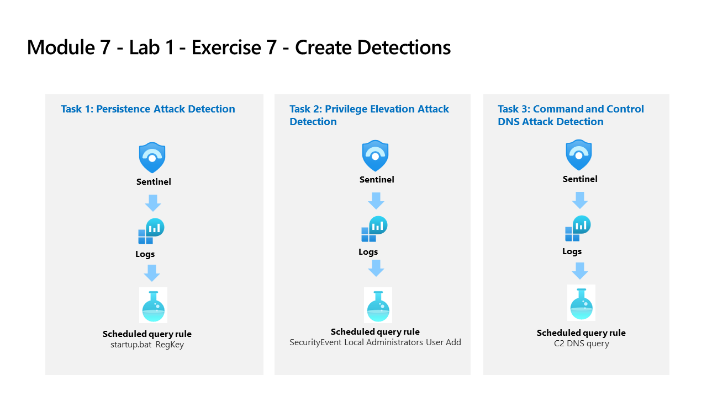

---
lab:
  title: Exercise 6 - Create Detections
  module: Learning Path 9 - Create detections and perform investigations using Microsoft Sentinel
  description: In this task, you will create a detection for the first attack of the previous exercise.
  duration: 45 minutes
  level: 300
  islab: true
---

# Learning Path 9 - Lab 1 - Exercise 6 - Create Detections

## Lab scenario



You are a Security Operations Analyst working at a company that implemented Microsoft Sentinel. You are going to work with Log Analytics KQL queries and from there, you will create custom analytics rules to help discover threats and anomalous behaviors in your environment.

Analytics rules search for specific events or sets of events across your environment, alert you when certain event thresholds or conditions are reached, generate incidents for your SOC to triage and investigate, and respond to threats with automated tracking and reMediation processes.

>**Important:** The lab exercises for Learning Path #9 are in a *standalone* environment. If you exit the lab before completing it, you will be required to re-run the configurations again.

### Estimated time to complete this lab: 45 minutes

### Task 1: Persistence Attack Detection

>**Important:** The next steps are done in a different machine than the one you were previously working. Look for the Virtual Machine name references.

In this task, you will create a detection for the first attack of the previous exercise.

>**Note:** Microsoft Sentinel has been predeployed in your Azure subscription with the name **defenderWorkspace**, and the required *Content hub* solutions have been installed.

1. Sign in to **WIN1** virtual machine as Admin using the provided credentials.

1. Open **Microsoft Edge** and navigate to **Microsoft Defender XDR** at `https://security.microsoft.com`.

1. In the **Sign in** dialog box, copy, and paste in the **Tenant Email** account provided by your lab hosting provider and then select **Next**.

1. In the **Enter password** dialog box, copy, and paste in the **Tenant Password** provided by your lab hosting provider and then select **Sign in**.

    >**Note:** You may be prompted to enter the *Temporary Access Pass* (TAP) instead of a password. This is also provided in the resources tab. If prompted, copy and paste the TAP value and select **Sign in**.

1. In the Microsoft Defender navigation menu, scroll down and expand the **Investigation & response** section.

1. Expand the **Hunting** section and select **Advanced hunting**.

1. **Run** the following KQL Statement again to recall the tables where we have this data:

    ```KQL
    search "temp\\startup.bat"
    ```

    >**Note:** A result with the event might take up to 5 minutes to appear. Wait until it does. If it does not appear, make sure you have rebooted WINServer as instructed in the previous exercise and that you have completed the Task #3 of the Learning Path 6 Lab, Exercise 2.

1. The table *SecurityEvent* looks to have the data already normalized and easy for us to query. Expand the row to see all the columns related to the record.

1. From the results, we now know that the Threat Actor is using reg.exe to add keys to the Registry key and the program is located in C:\temp. **Run** the following statement to replace the *search* operator with the *where* operator in our query:

    ```KQL
    SecurityEvent 
    | where Activity startswith "4688" 
    | where Process == "reg.exe" 
    | where CommandLine startswith "REG" 
    ```

1. It is important to help the Security Operations Center Analyst by providing as much context about the alert as you can. This includes projecting Entities for use in the investigation graph. **Run** the following query:

    ```KQL
    SecurityEvent 
    | where Activity startswith "4688" 
    | where Process == "reg.exe" 
    | where CommandLine startswith "REG" 
    | extend timestamp = TimeGenerated, HostCustomEntity = Computer, AccountCustomEntity = SubjectUserName
    ```

1. Now that you have a good detection rule KQL query, select **Create detection rule** in the command bar. This will create a new Scheduled rule.

    >**Note:** If you don't see the option, make sure you have selected the row with the event in the results.

1. This opens the "Custom detection" page. For the *General* page type:

    |Setting|Value|
    |---|---|
    |Name|Startup RegKey|
    |Description|Startup RegKey in c:\temp|
    |Category|Persistence|
    |Severity|High|

1. The *Rule query* should be populated already with your KQL query.

1. For *Frequency* you can leave the default *Continuos (NRT)* setting, or select *Custom* from the dropdown menu and enter the following:

    |Setting|Value|
    |---|---|
    |Run Query every|5 minutes|
    |Lookback|set automatically|

    >**Note:** We are purposely generating many incidents for the same data. This enables the Lab to use these alerts.

1. Leave the rest of the options with the defaults. Select the **Next** button.

1. On the **Alert settings** page, in the **Alert details** section, enter the following:
    
    |Setting|Value|
    |---|---|
    |Alert title|**Alert from {{Computer}}**|
    |Description|**Alert from {{Process}} at {{TimeGenerated}}**|

1. In the **Custom details** section, enter a key-value pair as follows:

    |Key|Parameter|
    |:----|:----|
    |Activity|EventID|

1. configure the entities under *Entity mapping* using the parameters in the table below.

    |Entity|Identifier|Column|
    |:----|:----|:----|    
    |Device|Hostname|HostCustomEntity|

1. Select **Next**.

    <!--- 1. For the *Incident settings* tab, leave the default values and select **Next: Automated response >** button. --->

1. On the **Automated actions** page under *Remediation actions to take*, expand the **Devices** section and select the following:`

    - **Collect investigation package**
    - **Initialize investigation**


1. Select **Next**.

1. On the **Review and create** page, review the detection rule settings and select the **Submit** button to create the new Custom detection rule.

1. You should see that the rule was saved successfully, and be back in **Advanced hunting** query page.

     <!--- 1. Use the settings in the table to configure the automation rule.

    |Setting|Value|
    |:----|:----|
    |Automation rule name|Startup RegKey|
    |Trigger|When incident is created|
    |Actions |Run playbook|
    |playbook |Defender_XDR_Ransomware_Playbook_SecOps-Tasks|

    >**Note:** You have already assigned permissions to the playbook, so it will be available.

    1. Select **Apply**

    1. Select the **Next: Review + create >** button.
  
    1. On the *Review and create* tab, select the **Save** button to create the new Scheduled Analytics rule. --->

### Task 2: Privilege Elevation Attack Detection

In this task, you will create a detection for the second attack of the previous exercise.

>**Note:** We have configured the Local Security Policy on the WINServer machine to log 4732 events. This is configured in the *Advanced Audit Policy Configuration > System Audit Policies - Local Group Policy Object > Account Management > Audit Security Group Management: Success and failure*.

1. In the Microsoft Defender navigation menu, scroll down and expand the **Investigation & response** section.

1. Expand the **Hunting** section and select **Advanced hunting**.

1. **Run** the following KQL Statement to identify any entry that refers to administrators:

    ```KQL
    search "administrators" 
    | summarize count() by $table
    ```

1. The result might show events from different tables, but in our case, we want to investigate the SecurityEvent table. The EventID and Event that we are looking for is *4732 - A member was added to a security-enabled local group*. With this, we will identify adding a member to a privileged group. **Run** the following KQL query to confirm:

    ```KQL
    SecurityEvent 
    | where EventID == 4732
    | where TargetAccount == "Builtin\\Administrators"
    ```

1. Expand the row to see all the columns related to the record. The username of the account added as Administrator does not show. The issue is that instead of storing the username, we have the Security IDentifier (SID). **Run** the following KQL to match the SID to the username that was added to the Administrators group:

    ```KQL
    SecurityEvent 
    | where EventID == 4732
    | where TargetAccount == "Builtin\\Administrators"
    | extend Acct = MemberSid, MachId = SourceComputerId  
    | join kind=leftouter (
        SecurityEvent 
        | summarize count() by TargetSid, SourceComputerId, TargetUserName 
        | project Acct1 = TargetSid, MachId1 = SourceComputerId, UserName1 = TargetUserName) on $left.MachId == $right.MachId1, $left.Acct == $right.Acct1
    ```

1. Extend the row to show the resulting columns, in the last one, we see the name of the added user under the *UserName1* column we *project* within the KQL query. It is important to help the Security Operations Analyst by providing as much context about the alert as you can. This includes projecting Entities for use in the investigation graph. **Run** the following query:

    ```KQL
    SecurityEvent 
    | where EventID == 4732
    | where TargetAccount == "Builtin\\Administrators"
    | extend Acct = MemberSid, MachId = SourceComputerId  
    | join kind=leftouter (
        SecurityEvent 
        | summarize count() by TargetSid, SourceComputerId, TargetUserName 
        | project Acct1 = TargetSid, MachId1 = SourceComputerId, UserName1 = TargetUserName) on $left.MachId == $right.MachId1, $left.Acct == $right.Acct1
    | extend timestamp = TimeGenerated, HostCustomEntity = Computer, AccountCustomEntity = UserName1
    ```

1. Now that you have a good detection rule, select **Create detection rule** in the command bar.

1. This opens the "Custom detection" page.

1. For this rule we're going to use *Create analytics rule instead* option. 

1. Select the **Create analytics rule instead** link at the upper right of the page.

1. This starts the *Analytics rule wizard*. On the **General** page type:

    |Setting|Value|
    |---|---|
    |Name|**SecurityEvent Local Administrators User Add**|
    |Description|**User added to Local Administrators group**|
    |Severity|**High**|
    |MITRE ATT&CK|**Privilege Escalation**|
   

1. Select **Next: Set rule logic >** button.

1. On the **Set rule logic** page, the *Rule query* should be populated already with your KQL query.

1.  Under *Alert enhancement - Entity mapping*, select **+ Add new entity**, and use the following settings:

    |Entity|Identifier|Data Field|
    |:----|:----|:----|
    |Account|FullName|AccountCustomEntity|
    |Host|Hostname|HostCustomEntity|

1. If **Hostname** isn't selected for *Host* Entity, select **+ Add new entity** again, and select it from the drop-down list and use the parameters in the preceding table to populate the fields.

1. For *Query scheduling* set the following:

    |Setting|Value|
    |---|---|
    |Run Query every|5 minutes|
    |Lookup data from the last|1 Days|

    >**Note:** We are purposely generating many incidents for the same data. This enables the Lab to use these alerts.

1. Leave the rest of the options with the defaults. Select **Next: Incident settings>** button.

1. For the **Incident settings** tab, leave the default values and select **Next: Automated response >** button.

1. On the **Automated response** tab under *Automation rules*, select **Add new**.

1. Use the settings in the table to configure the automation rule.

   |Setting|Value|
   |:----|:----|
   |Automation rule name|SecurityEvent Local Administrators User Add|
   |Trigger|When incident is created|
   |Actions |Run playbook|
   |playbook |Defender_XDR_Ransomware_Playbook_SecOps-Tasks|

   >**Note:** You have already assigned permissions to the playbook, so it will be available.

1. Select **Apply**

1. Select the **Next: Review and create >** button.
  
1. On the **Review and create** tab, select the **Save** button to save the new Scheduled Analytics rule.

## Proceed to Exercise 7
