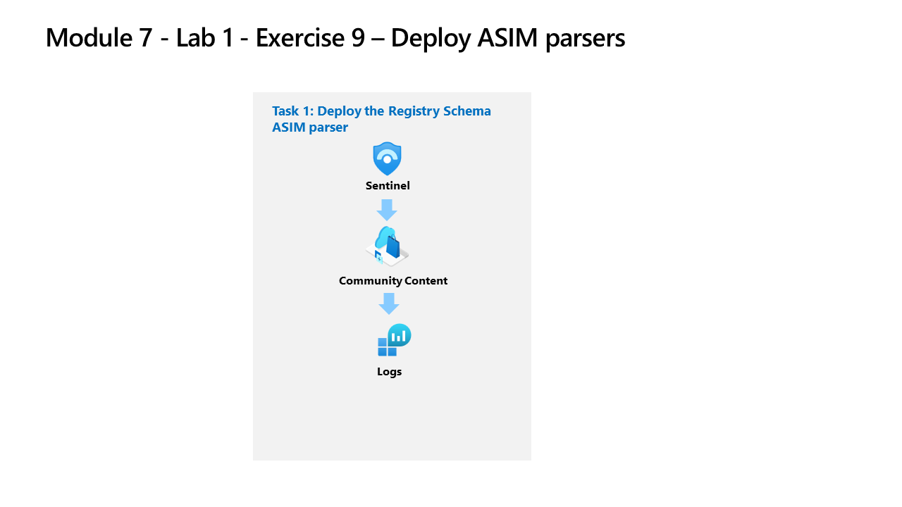

---
lab:
    title: 'Exercise 8 - Create ASIM parsers'
    module: 'Learning Path 9 - Create detections and perform investigations using Microsoft Sentinel'
---

# Learning Path 9 - Lab 1 - Exercise 8 - Deploy ASIM parsers

## Lab scenario

You're a Security Operations Analyst working at a company that implemented Microsoft Sentinel. You need to model ASIM parsers for a specific Windows registry event. These parsers will be finalized at a later time following the [Advanced Security Information Model (ASIM) Registry Event normalization schema reference](https://docs.microsoft.com/azure/sentinel/registry-event-normalization-schema).

>**Important:** The lab exercises for Learning Path #9 are in a *standalone* environment. If you exit the lab before completing it, you will be required to re-run the configurations again.

### Estimated time to complete this lab: 30 minutes

### Task 1: Deploy the Registry Schema ASIM parsers

In this task, you'll review the Registry Schema parsers that are included with the Microsoft Sentinel deployment.

>**Note:** Microsoft Sentinel has been predeployed and onboarded to Microsoft Defender XDR with the name **sentinelworkspace-01**, and the required *Content hub* solutions have been installed.

1. Sign in to **WIN1** virtual machine as Admin using the provided credentials.

1. Open **Microsoft Edge** and navigate to **Microsoft Defender XDR** at `https://security.microsoft.com`.

1. In the **Sign in** dialog box, copy, and paste in the **Tenant Email** account provided by your lab hosting provider and then select **Next**.

1. In the **Enter password** dialog box, copy, and paste in the **Tenant Password** provided by your lab hosting provider and then select **Sign in**.

    >**Note:** You may be prompted to enter the *Temporary Access Pass* (TAP) instead of a password. This is also provided in the resources tab. If prompted, copy and paste the TAP value and select **Sign in**.

1. In the Microsoft Defender navigation menu, scroll down and expand the **Investigation & response** section.

1. Expand the **Hunting** section and select **Advanced hunting**.

1. Open the **Schema and Search** blade by selecting **>** if needed.

1. Select the **Functions** tab (next to the Queries tab). **Hint:** You might need to select the ellipsis icon **(...)** to select the tab.

1. In the *Search* bar type **registry**, and scroll down through the ASIM parser functions until you see the following *_Im_RegistryEvent_MicrosoftWindowsEventxxx* for Microsoft Windows under the *Microsoft Sentinel* heading.

    >**Note:** We're using the xxx in the ASIM parser function name to account for version changes. At the time this lab was updated the function was _Im_RegistryEvent_MicrosoftWindowsEvent*V02*.

1. Locate the **_Im_RegistryEvent_MicrosoftWindowsEventxxx** ASIM function and then select **Load the function code** from the ellipsis icon **(...)**.

1. Review the KQL that is parsing the Event ID 4657 to simplifying your analysis of the data in the Microsoft Sentinel workspace.

    >**Hint:** Typing ctrl+f in the code window brings up *Find* and makes searching for *EventID: 4657* much easier.

1. From the command bar, select **New query** to open a new query tab.

1. Go back to the **Schema** pane, hover over the **_Im_RegistryEvent_MicrosoftWindowsEventxxx** ASIM function, and then select **Use in editor**.

1. Select **Run** to execute the ASIM function query. If you have completed the previous lab exercises, you should see results and no error messages.

## Proceed to Exercise 9
