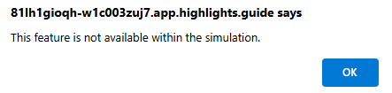

# Module 9 - Microsoft Sentinel Data Lake and Defender XDR Integration

**Note** .

## Understanding Microsoft Sentinel Data Lake Architecture

In this task, you will explore the Microsoft Sentinel data lake architecture and its integration with Microsoft Defender XDR for unified security operations.

### Key Areas Covered

- Data Lake Architecture and Components
- Data Ingestion and Transformation
- Cross-Platform Data Correlation
- Unified Investigation Experience
- Advanced Analytics and ML Models

>**Note:**
> The environment for this exercise is a simulation generated from the product. As a limited simulation, links on a page may not be enabled and text-based inputs that fall outside of the specified script may not be supported. A pop-up message will display stating, "This feature is not available within the simulation." When this occurs, select OK and continue the exercise steps.  

1. Open the simulated environment by selecting this link: **[Defender portal](https://app.highlights.guide/start/9fe10dd1-7e73-4519-9a4e-ebc9f468f92b?guide=true&token=32d473ab-8f08-46ec-ab53-f2aaa3f585e6)**.

1. Follow the steps in the simulation to explore the Microsoft Sentinel data lake architecture and its integration with Microsoft Defender XDR.

## You have completed the demo

---

**Additional Resources:**

- [Microsoft Sentinel Data Lake Architecture](https://docs.microsoft.com/azure/sentinel/overview)
- [Defender XDR Integration Guide](https://docs.microsoft.com/microsoft-365/security/defender/microsoft-365-defender-integration-with-azure-sentinel)
- [KQL Query Optimization](https://docs.microsoft.com/azure/data-explorer/kusto/query/best-practices)
- [Advanced Hunting in Microsoft Defender XDR](https://docs.microsoft.com/microsoft-365/security/defender/advanced-hunting-overview)
